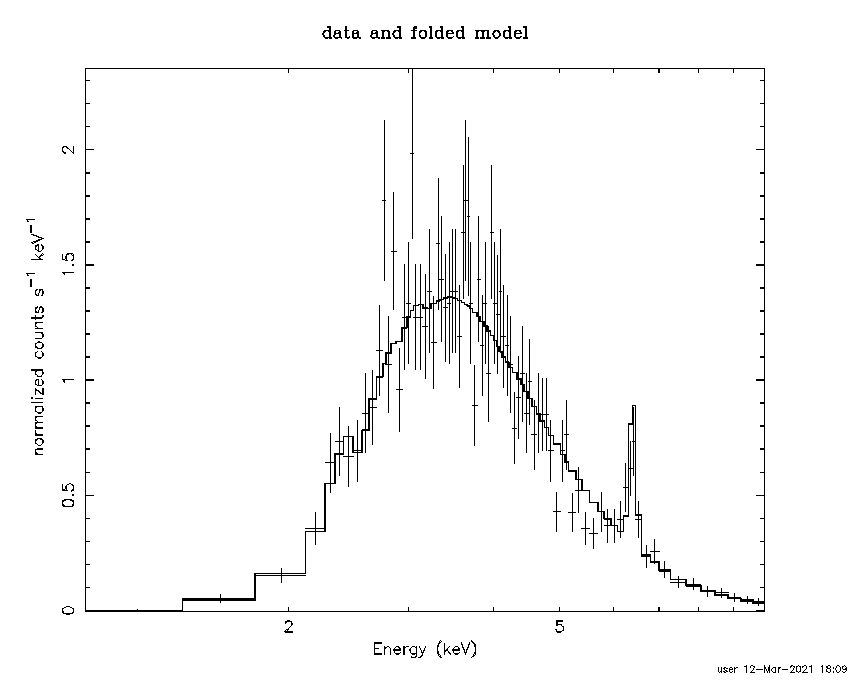

BXA/Sherpa example scripts
==========================

This folder contains simple and complex examples
how BXA can be invoked for spectral analysis.

Please refer to https://johannesbuchner.github.io/BXA/
for full documentation, including how to install BXA.

Test data
-------------------

As test data, this includes the spectral file example-file.fak
representing a ATHENA observation of an absorbed AGN, and the corresponding 
response.

The spectrum looks something like this:

Simple analysis
-----------------

Have a look at the file example_simplest.py. It contains:

* Loading data
* setting up a model and its parameter ranges
* running a BXA fit with specified priors

See https://johannesbuchner.github.io/BXA/ to understand the code.
See https://johannesbuchner.github.io/UltraNest/ to understand the output of the
fitting engine (for example, its `FAQ page <https://johannesbuchner.github.io/UltraNest/issues.html>`_).

Expected output::

	$ python3 example_simplest.py
	read RMF file athenapp_ir_b4c_wfi_withfilter_fov40.0arcmin_avg.rsp
	[ultranest] Sampling 400 live points from prior ...

	Mono-modal Volume: ~exp(-4.69) * Expected Volume: exp(0.00) Quality: ok

	mypow.gamma:      +1.0|************************************************************************************|     +3.0
	mypow.ampl :  +1.0e-10|************ ** * * *  ***    * * * * *  *      * * *    * *        *     **  *   * | +1.0e+01

	Z=-1436853.7(0.00%) | Like=-1425796.15..-4079.21 [-1.09e+08..-4333] | it/evals=80/481 eff=98.7654% N=400 0 

	Mono-modal Volume: ~exp(-4.69)   Expected Volume: exp(-0.23) Quality: ok

	mypow.gamma:      +1.0|************************************************************************************|     +3.0
	mypow.ampl :  +1.0e-10|*********** *** ***  * *** ***   **        **  *      *      * ** *  +7.9e-02       | +1.0e-01

	Z=-49990.0(0.00%) | Like=-48482.70..-4079.21 [-1.09e+08..-4333] | it/evals=160/566 eff=96.3855% N=400 0 

	Mono-modal Volume: ~exp(-4.69)   Expected Volume: exp(-0.45) Quality: ok

	mypow.gamma:      +1.0|************************************************************************************|     +3.0
	mypow.ampl :  +1.0e-10|************* ***   *   * *  +3.2e-03                                               | +1.0e-02

	Z=-28599.1(0.00%) | Like=-28584.11..-4079.21 [-1.09e+08..-4333] | it/evals=240/650 eff=96.0000% N=400 

	Mono-modal Volume: ~exp(-5.23) * Expected Volume: exp(-0.67) Quality: ok

	mypow.gamma:      +1.0|**************************** *******************************************************|     +3.0
	mypow.ampl :  +1.0e-10|************* ****  *  +2.4e-03                                                     | +1.0e-02

	Z=-23814.6(0.00%) | Like=-23785.78..-4079.21 [-1.09e+08..-4333] | it/evals=320/748 eff=91.9540% N=400 

	Mono-modal Volume: ~exp(-5.23)   Expected Volume: exp(-0.90) Quality: ok

	mypow.gamma:      +1.0|******************************************************************** ***************|     +3.0
	mypow.ampl :  +1.0e-10|************* * ** *  +2.3e-03                                                      | +1.0e-02

	Z=-18339.2(0.00%) | Like=-18303.01..-4079.21 [-1.09e+08..-4333] | it/evals=440/880 eff=91.6667% N=400 

	Mono-modal Volume: ~exp(-5.23)   Expected Volume: exp(-1.12) Quality: ok

	mypow.gamma:      +1.0|********************************************************************** *************|     +3.0
	mypow.ampl :  +1.0e-10|*************   *  +2.0e-03                                                         | +1.0e-02

	Z=-15475.0(0.00%) | Like=-15444.04..-4067.92 [-1.09e+08..-4333] | it/evals=520/977 eff=90.1213% N=400 

	Mono-modal Volume: ~exp(-5.52) * Expected Volume: exp(-1.35) Quality: ok

	mypow.gamma:      +1.0|************************************ ******************************************* ***|     +3.0
	mypow.ampl :  +1.0e-10|************  +1.4e-03                                                              | +1.0e-02

	Z=-13226.8(0.00%) | Like=-13216.88..-4067.92 [-1.09e+08..-4333] | it/evals=600/1070 eff=89.5522% N=400 

	Mono-modal Volume: ~exp(-5.52)   Expected Volume: exp(-1.57) Quality: ok

	mypow.gamma:      +1.0|******************************************* ********************************** **** |     +3.0
	mypow.ampl :  +1.0e-10|***********  +1.3e-03                                                               | +1.0e-02

	Z=-11727.7(0.00%) | Like=-11707.66..-4042.40 [-1.09e+08..-4333] | it/evals=680/1175 eff=87.7419% N=400 

	Mono-modal Volume: ~exp(-5.82) * Expected Volume: exp(-1.80) Quality: ok

	mypow.gamma:      +1.0|******************************************* ********************************** **** |     +3.0
	mypow.ampl :  +1.0e-10|**********  +1.1e-03                                                                | +1.0e-02

	Z=-9850.1(0.00%) | Like=-9833.59..-4042.40 [-1.09e+08..-4333] | it/evals=800/1321 eff=86.8621% N=400 0 

	Mono-modal Volume: ~exp(-6.36) * Expected Volume: exp(-2.02) Quality: ok

	mypow.gamma:      +1.0|**********************************************************************  +2.7        |     +3.0
	mypow.ampl :  +1.0e-10|*********  +1.0e-03                                                                 | +1.0e-02

	Z=-9111.3(0.00%) | Like=-9088.80..-4014.82 [-1.09e+08..-4333] | it/evals=880/1422 eff=86.1057% N=400 

	Mono-modal Volume: ~exp(-6.36)   Expected Volume: exp(-2.25) Quality: ok

	mypow.gamma:      +1.0|************************************************************** *  +2.5              |     +3.0
	mypow.ampl :  +1.0e-10|*****************************************  ** ****    *** ****  *** **   *  +8.8e-04| +1.0e-03

	Z=-8390.6(0.00%) | Like=-8379.03..-4014.82 [-1.09e+08..-4333] | it/evals=960/1541 eff=84.1367% N=400 

	Mono-modal Volume: ~exp(-6.66) * Expected Volume: exp(-2.47) Quality: ok

	mypow.gamma:      +1.0|*******************************************************  +2.3                       |     +3.0
	mypow.ampl :  +1.0e-10|********************************************* ****  ***** ****  *** **   *  +8.8e-04| +1.0e-03

	Z=-7775.5(0.00%) | Like=-7762.79..-4014.82 [-1.09e+08..-4333] | it/evals=1040/1650 eff=83.2000% N=400 

	Mono-modal Volume: ~exp(-6.97) * Expected Volume: exp(-2.70) Quality: ok

	mypow.gamma:      +1.0|*************************************************  +2.1                             |     +3.0
	mypow.ampl :  +1.0e-10| ************************************* ****** ****  ***** ****  +7.3e-04            | +1.0e-03

	Z=-7136.5(0.00%) | Like=-7127.33..-4014.82 [-1.09e+08..-4333] | it/evals=1160/1803 eff=82.6800% N=400 

	Mono-modal Volume: ~exp(-7.29) * Expected Volume: exp(-2.92) Quality: ok

	mypow.gamma:      +1.0|*******************************************  +2.0                                   |     +3.0
	mypow.ampl :  +1.0e-10| ************************************* ****** ****** **** * *  +7.2e-04             | +1.0e-03

	Z=-6781.9(0.00%) | Like=-6772.22..-4014.82 [-1.09e+08..-4333] | it/evals=1240/1895 eff=82.9431% N=400 

	Mono-modal Volume: ~exp(-7.59) * Expected Volume: exp(-3.15) Quality: ok

	mypow.gamma:      +1.0|**************************************  +1.9                                        |     +3.0
	mypow.ampl :  +1.0e-10| ************************************* ************* ****  +6.8e-04                 | +1.0e-03

	Z=-6439.0(0.00%) | Like=-6429.44..-4014.82 [-1.09e+08..-4333] | it/evals=1320/2008 eff=82.0896% N=400 

	Mono-modal Volume: ~exp(-7.59)   Expected Volume: exp(-3.37) Quality: ok

	mypow.gamma:      +1.0|*********************************  +1.8                                             |     +3.0
	mypow.ampl :  +1.0e-10|  **************************************** ********* *  +6.4e-04                    | +1.0e-03

	Z=-6156.2(0.00%) | Like=-6135.97..-4014.82 [-1.09e+08..-4333] | it/evals=1400/2118 eff=81.4901% N=400 

	Mono-modal Volume: ~exp(-8.05) * Expected Volume: exp(-3.60) Quality: ok

	mypow.gamma:      +1.0|************************** *  +1.7                                                  |     +3.0
	mypow.ampl :  +1.0e-10|   *************************************** *** **  *  +6.1e-04                      | +1.0e-03

	Z=-5693.3(0.00%) | Like=-5673.11..-3982.43 [-1.09e+08..-4333] | it/evals=1520/2263 eff=81.5888% N=400 

	Mono-modal Volume: ~exp(-8.16) * Expected Volume: exp(-3.82) Quality: ok

	mypow.gamma:      +1.0|*************************  +1.6                                                     |     +3.0
	mypow.ampl :  +1.0e-10|   ***************************************  **  +5.4e-04                            | +1.0e-03

	Z=-5437.6(0.00%) | Like=-5420.08..-3975.18 [-1.09e+08..-4333] | it/evals=1600/2362 eff=81.5494% N=400 

	Mono-modal Volume: ~exp(-8.16)   Expected Volume: exp(-4.05) Quality: ok

	mypow.gamma:      +1.0|**********************  +1.5                                                        |     +3.0
	mypow.ampl :  +1.0e-10|   *************************************** *  +5.2e-04                              | +1.0e-03

	Z=-5275.0(0.00%) | Like=-5263.43..-3975.18 [-1.09e+08..-4333] | it/evals=1680/2469 eff=81.1986% N=400 

	Mono-modal Volume: ~exp(-8.40) * Expected Volume: exp(-4.27) Quality: ok

	mypow.gamma:      +1.0|******************  +1.4                                                            |     +3.0
	mypow.ampl :  +1.0e-10|    ******************************** *****  +5.0e-04                                | +1.0e-03

	Z=-5089.4(0.00%) | Like=-5078.33..-3975.18 [-1.09e+08..-4333] | it/evals=1760/2567 eff=81.2183% N=400 

	Mono-modal Volume: ~exp(-8.83) * Expected Volume: exp(-4.50) Quality: ok

	mypow.gamma:      +1.0|****************  +1.4                                                              |     +3.0
	mypow.ampl :  +1.0e-10|     *********************************  +4.5e-04                                    | +1.0e-03

	Z=-4863.3(0.00%) | Like=-4852.01..-3975.18 [-1.09e+08..-4333] | it/evals=1880/2729 eff=80.7213% N=400 

	Mono-modal Volume: ~exp(-8.83)   Expected Volume: exp(-4.73) Quality: ok

	mypow.gamma:      +1.0|**************  +1.3                                                                |     +3.0
	mypow.ampl :  +1.0e-10|     ********************************  +4.3e-04                                     | +1.0e-03

	Z=-4752.0(0.00%) | Like=-4740.26..-3975.18 [-1.09e+08..-4333] | it/evals=1960/2829 eff=80.6916% N=400 

	Mono-modal Volume: ~exp(-9.23) * Expected Volume: exp(-4.95) Quality: ok

	mypow.gamma:      +1.0|************  +1.3                                                                  |     +3.0
	mypow.ampl :  +1.0e-10|      ************************** *  +4.0e-04                                        | +1.0e-03

	Z=-4640.0(0.00%) | Like=-4628.87..-3975.18 [-1.09e+08..-4333] | it/evals=2040/2932 eff=80.5687% N=400 

	Mono-modal Volume: ~exp(-9.40) * Expected Volume: exp(-5.18) Quality: ok

	mypow.gamma:      +1.0|**********  +1.2                                                                    |     +3.0
	mypow.ampl :  +1.0e-10|       *************************  +3.8e-04                                          | +1.0e-03

	Z=-4552.1(0.00%) | Like=-4540.22..-3975.18 [-1.09e+08..-4333] | it/evals=2120/3036 eff=80.4249% N=400 

	Mono-modal Volume: ~exp(-9.40)   Expected Volume: exp(-5.40) Quality: ok

	mypow.gamma:      +1.0|*********  +1.2                                                                     |     +3.0
	mypow.ampl :  +1.0e-10|       ************************  +3.7e-04                                           | +1.0e-03

	Z=-4456.3(0.00%) | Like=-4444.47..-3952.75 [-1.09e+08..-4333] | it/evals=2240/3192 eff=80.2292% N=400 

	Mono-modal Volume: ~exp(-9.76) * Expected Volume: exp(-5.63) Quality: ok

	mypow.gamma:      +1.0|********  +1.2                                                                      |     +3.0
	mypow.ampl :  +1.0e-10|       ************************  +3.6e-04                                           | +1.0e-03

	Z=-4399.4(0.00%) | Like=-4388.16..-3952.75 [-1.09e+08..-4333] | it/evals=2320/3305 eff=79.8623% N=400 

	Mono-modal Volume: ~exp(-10.34) * Expected Volume: exp(-5.85) Quality: ok

	mypow.gamma:      +1.0|*******  +1.2                                                                       |     +3.0
	mypow.ampl :  +1.0e-10|        *********************  +3.4e-04                                             | +1.0e-03

	Z=-4349.4(0.00%) | Like=-4338.36..-3952.75 [-1.09e+08..-4333] | it/evals=2400/3402 eff=79.9467% N=400 

	Mono-modal Volume: ~exp(-10.34)   Expected Volume: exp(-6.08) Quality: ok

	mypow.gamma:      +1.0|******  +1.1                                                                        |     +3.0
	mypow.ampl :   +0.0000|        ********************  +0.0003                                               |  +0.0010

	Z=-4300.8(0.00%) | Like=-4289.26..-3952.75 [-4332.2367..-3960.1176] | it/evals=2480/3509 eff=79.7684% N=400 

	Mono-modal Volume: ~exp(-10.59) * Expected Volume: exp(-6.30) Quality: ok

	mypow.gamma:      +1.0|******  +1.1                                                                        |     +3.0
	mypow.ampl :   +0.0000|         ******************  +0.0003                                                |  +0.0010

	Z=-4243.0(0.00%) | Like=-4230.88..-3952.75 [-4332.2367..-3960.1176] | it/evals=2600/3665 eff=79.6325% N=400 

	Mono-modal Volume: ~exp(-10.77) * Expected Volume: exp(-6.53) Quality: ok

	mypow.gamma:      +1.0|*****  +1.1                                                                         |     +3.0
	mypow.ampl :   +0.0000|         ******************  +0.0003                                                |  +0.0010

	Z=-4208.7(0.00%) | Like=-4197.23..-3952.75 [-4332.2367..-3960.1176] | it/evals=2680/3756 eff=79.8570% N=400 

	Mono-modal Volume: ~exp(-10.77)   Expected Volume: exp(-6.75) Quality: ok

	mypow.gamma:      +1.0|****  +1.1                                                                          |     +3.0
	mypow.ampl :   +0.0000|          ****************  +0.0003                                                 |  +0.0010

	Z=-4180.7(0.00%) | Like=-4168.58..-3952.75 [-4332.2367..-3960.1176] | it/evals=2760/3872 eff=79.4931% N=400 

	Mono-modal Volume: ~exp(-11.38) * Expected Volume: exp(-6.98) Quality: ok

	mypow.gamma:      +1.0|****  +1.1                                                                          |     +3.0
	mypow.ampl :   +0.0000|          ***************  +0.0003                                                  |  +0.0010

	Z=-4148.6(0.00%) | Like=-4135.69..-3952.75 [-4332.2367..-3960.1176] | it/evals=2840/3967 eff=79.6187% N=400 

	Mono-modal Volume: ~exp(-11.38)   Expected Volume: exp(-7.20) Quality: ok

	mypow.gamma:      +1.0|***  +1.1                                                                           |     +3.0
	mypow.ampl :   +0.0000|          **************  +0.0003                                                   |  +0.0010

	Z=-4109.3(0.00%) | Like=-4097.52..-3952.75 [-4332.2367..-3960.1176] | it/evals=2960/4125 eff=79.4631% N=400 

	Mono-modal Volume: ~exp(-11.56) * Expected Volume: exp(-7.43) Quality: ok

	mypow.gamma:      +1.0|***  +1.1                                                                           |     +3.0
	mypow.ampl :   +0.0000|  +0.0001  *************  +0.0003                                                   |  +0.0010

	Z=-4091.7(0.00%) | Like=-4079.63..-3952.75 [-4332.2367..-3960.1176] | it/evals=3040/4236 eff=79.2492% N=400 

	Mono-modal Volume: ~exp(-11.56)   Expected Volume: exp(-7.65) Quality: ok

	mypow.gamma:     +1.00|***  +1.05                                                                          |    +3.00
	mypow.ampl :   +0.0000|  +0.0001  ************  +0.0003                                                    |  +0.0010

	Z=-4077.2(0.00%) | Like=-4064.74..-3952.75 [-4332.2367..-3960.1176] | it/evals=3120/4330 eff=79.3893% N=400 

	Mono-modal Volume: ~exp(-12.19) * Expected Volume: exp(-7.88) Quality: ok

	mypow.gamma:     +1.00|**  +1.04                                                                           |    +3.00
	mypow.ampl :   +0.0000|  +0.0001  ************  +0.0003                                                    |  +0.0010

	Z=-4059.8(0.00%) | Like=-4046.99..-3952.75 [-4332.2367..-3960.1176] | it/evals=3200/4432 eff=79.3651% N=400 

	Mono-modal Volume: ~exp(-12.23) * Expected Volume: exp(-8.10) Quality: ok

	mypow.gamma:     +1.00|**  +1.03                                                                           |    +3.00
	mypow.ampl :   +0.0000|   +0.0001  **********  +0.0003                                                     |  +0.0010

	Z=-4042.9(0.00%) | Like=-4030.36..-3952.75 [-4332.2367..-3960.1176] | it/evals=3320/4600 eff=79.0476% N=400 

	Mono-modal Volume: ~exp(-12.67) * Expected Volume: exp(-8.33) Quality: ok

	mypow.gamma:     +1.00|**  +1.03                                                                           |    +3.00
	mypow.ampl :   +0.0000|   +0.0001  **********  +0.0003                                                     |  +0.0010

	Z=-4032.5(0.00%) | Like=-4020.32..-3952.75 [-4332.2367..-3960.1176] | it/evals=3400/4706 eff=78.9596% N=400 

	Mono-modal Volume: ~exp(-12.67)   Expected Volume: exp(-8.55) Quality: ok

	mypow.gamma:     +1.00|**  +1.03                                                                           |    +3.00
	mypow.ampl :  +0.00000|  +0.00015  *********  +0.00025                                                     | +0.00100

	Z=-4025.4(0.00%) | Like=-4012.93..-3952.75 [-4332.2367..-3960.1176] | it/evals=3480/4810 eff=78.9116% N=400 

	Mono-modal Volume: ~exp(-12.67)   Expected Volume: exp(-8.78) Quality: ok

	mypow.gamma:     +1.00|*  +1.02                                                                            |    +3.00
	mypow.ampl :  +0.00000|   +0.00015  ********  +0.00025                                                     | +0.00100

	Z=-4018.9(0.00%) | Like=-4007.04..-3952.58 [-4332.2367..-3960.1176] | it/evals=3560/4926 eff=78.6567% N=400 

	Mono-modal Volume: ~exp(-13.22) * Expected Volume: exp(-9.00) Quality: ok

	mypow.gamma:     +1.00|*  +1.02                                                                            |    +3.00
	mypow.ampl :  +0.00000|   +0.00016  ********  +0.00024                                                     | +0.00100

	Z=-4008.1(0.00%) | Like=-3995.35..-3952.58 [-4332.2367..-3960.1176] | it/evals=3680/5093 eff=78.4147% N=400 

	Mono-modal Volume: ~exp(-13.22)   Expected Volume: exp(-9.23) Quality: ok

	mypow.gamma:     +1.00|*  +1.02                                                                            |    +3.00
	mypow.ampl :  +0.00000|   +0.00016  *******  +0.00024                                                      | +0.00100

	Z=-4002.5(0.00%) | Like=-3989.71..-3952.58 [-4332.2367..-3960.1176] | it/evals=3760/5198 eff=78.3660% N=400 

	Mono-modal Volume: ~exp(-13.87) * Expected Volume: exp(-9.45) Quality: ok

	mypow.gamma:     +1.00|*  +1.01                                                                            |    +3.00
	mypow.ampl :  +0.00000|   +0.00016  *******  +0.00023                                                      | +0.00100

	Z=-3996.8(0.00%) | Like=-3984.08..-3952.58 [-4332.2367..-3960.1176] | it/evals=3840/5301 eff=78.3514% N=400 

	Mono-modal Volume: ~exp(-13.87)   Expected Volume: exp(-9.68) Quality: ok

	mypow.gamma:     +1.00|*  +1.01                                                                            |    +3.00
	mypow.ampl :  +0.00000|   +0.00016  *******  +0.00023                                                      | +0.00100

	Z=-3992.8(0.00%) | Like=-3980.03..-3952.58 [-4332.2367..-3960.1176] | it/evals=3920/5399 eff=78.4157% N=400 

	Mono-modal Volume: ~exp(-14.11) * Expected Volume: exp(-9.90) Quality: ok

	mypow.gamma:     +1.00|*  +1.01                                                                            |    +3.00
	mypow.ampl :  +0.00000|   +0.00017  *******  +0.00023                                                      | +0.00100

	Z=-3987.3(0.00%) | Like=-3974.22..-3952.51 [-4332.2367..-3960.1176] | it/evals=4040/5556 eff=78.3553% N=400 

	Mono-modal Volume: ~exp(-14.41) * Expected Volume: exp(-10.13) Quality: ok

	mypow.gamma:    +1.000|*  +1.009                                                                           |   +3.000
	mypow.ampl :  +0.00000|    +0.00017  *****  +0.00023                                                       | +0.00100

	Z=-3984.3(0.00%) | Like=-3971.47..-3952.37 [-4332.2367..-3960.1176] | it/evals=4120/5648 eff=78.5061% N=400 

	Mono-modal Volume: ~exp(-14.89) * Expected Volume: exp(-10.35) Quality: ok

	mypow.gamma:    +1.000|*  +1.008                                                                           |   +3.000
	mypow.ampl :  +0.00000|    +0.00017  *****  +0.00022                                                       | +0.00100

	Z=-3982.3(0.00%) | Like=-3969.36..-3951.35 [-4332.2367..-3960.1176] | it/evals=4200/5743 eff=78.6075% N=400 

	Mono-modal Volume: ~exp(-15.11) * Expected Volume: exp(-10.58) Quality: ok

	mypow.gamma:    +1.000|*  +1.007                                                                           |   +3.000
	mypow.ampl :  +0.00000|    +0.00017  *****  +0.00022                                                       | +0.00100

	Z=-3979.9(0.00%) | Like=-3966.89..-3951.35 [-4332.2367..-3960.1176] | it/evals=4280/5843 eff=78.6331% N=400 

	Mono-modal Volume: ~exp(-15.24) * Expected Volume: exp(-10.80) Quality: ok

	mypow.gamma:    +1.000|*  +1.006                                                                           |   +3.000
	mypow.ampl :  +0.00000|    +0.00017  *****  +0.00022                                                       | +0.00100

	Z=-3977.2(0.00%) | Like=-3964.12..-3951.35 [-4332.2367..-3960.1176] | it/evals=4400/5995 eff=78.6416% N=400 

	Mono-modal Volume: ~exp(-15.60) * Expected Volume: exp(-11.02) Quality: ok

	mypow.gamma:    +1.000|*  +1.005                                                                           |   +3.000
	mypow.ampl :  +0.00000|    +0.00018  *****  +0.00022                                                       | +0.00100

	Z=-3975.7(0.00%) | Like=-3962.51..-3951.35 [-4332.2367..-3960.1176] | it/evals=4480/6095 eff=78.6655% N=400 

	Mono-modal Volume: ~exp(-15.60)   Expected Volume: exp(-11.25) Quality: ok

	mypow.gamma:    +1.000|*  +1.004                                                                           |   +3.000
	mypow.ampl :  +0.00000|    +0.00018  *****  +0.00021                                                       | +0.00100

	Z=-3974.4(0.02%) | Like=-3961.31..-3951.35 [-4332.2367..-3960.1176] | it/evals=4560/6190 eff=78.7565% N=400 

	Mono-modal Volume: ~exp(-15.84) * Expected Volume: exp(-11.47) Quality: ok

	mypow.gamma:    +1.000|*  +1.004                                                                           |   +3.000
	mypow.ampl :  +0.00000|    +0.00018  *****  +0.00021                                                       | +0.00100

	Z=-3973.3(0.05%) | Like=-3959.89..-3951.35 [-3960.1160..-3955.4960] | it/evals=4640/6292 eff=78.7508% N=400 

	Mono-modal Volume: ~exp(-16.06) * Expected Volume: exp(-11.70) Quality: ok

	mypow.gamma:    +1.000|*  +1.003                                                                           |   +3.000
	mypow.ampl :  +0.00000|     +0.00018  ***  +0.00021                                                        | +0.00100

	Z=-3971.7(0.27%) | Like=-3958.30..-3951.35 [-3960.1160..-3955.4960] | it/evals=4760/6446 eff=78.7297% N=400 

	Mono-modal Volume: ~exp(-16.14) * Expected Volume: exp(-11.92) Quality: ok

	mypow.gamma:    +1.000|*  +1.003                                                                           |   +3.000
	mypow.ampl :  +0.00000|     +0.00018  ***  +0.00021                                                        | +0.00100

	Z=-3970.9(0.62%) | Like=-3957.53..-3951.35 [-3960.1160..-3955.4960] | it/evals=4840/6550 eff=78.6992% N=400 

	Mono-modal Volume: ~exp(-16.38) * Expected Volume: exp(-12.15) Quality: ok

	mypow.gamma:    +1.000|*  +1.002                                                                           |   +3.000
	mypow.ampl :  +0.00000|     +0.00018  ***  +0.00021                                                        | +0.00100

	Z=-3970.2(1.22%) | Like=-3956.76..-3951.30 [-3960.1160..-3955.4960] | it/evals=4920/6660 eff=78.5942% N=400 

	Mono-modal Volume: ~exp(-16.72) * Expected Volume: exp(-12.37) Quality: ok

	mypow.gamma:    +0.000|                    +1.000  *  +1.002                                               |   +3.000
	mypow.ampl :  +0.00000|     +0.00018  ***  +0.00021                                                        | +0.00100

	Z=-3969.6(2.35%) | Like=-3955.93..-3951.30 [-3960.1160..-3955.4960] | it/evals=5000/6775 eff=78.4314% N=400 

	Mono-modal Volume: ~exp(-17.25) * Expected Volume: exp(-12.60) Quality: ok

	mypow.gamma:    +0.000|                    +1.000  *  +1.002                                               |   +3.000
	mypow.ampl :  +0.00000|     +0.00018  ***  +0.00021                                                        | +0.00100

	Z=-3968.8(5.38%) | Like=-3955.08..-3951.30 [-3955.4918..-3954.6140] | it/evals=5120/6924 eff=78.4795% N=400 

	Mono-modal Volume: ~exp(-17.25)   Expected Volume: exp(-12.82) Quality: ok

	mypow.gamma:    +0.000|                    +1.000  *  +1.002                                               |   +3.000
	mypow.ampl :  +0.00000|     +0.00019  ***  +0.00021                                                        | +0.00100

	Z=-3968.3(8.30%) | Like=-3954.58..-3951.30 [-3954.6009..-3954.3077] | it/evals=5200/7020 eff=78.5498% N=400 

	Mono-modal Volume: ~exp(-17.51) * Expected Volume: exp(-13.05) Quality: ok

	mypow.gamma:    +0.000|                    +1.000  *  +1.001                                               |   +3.000
	mypow.ampl :  +0.00000|     +0.00019  ***  +0.00021                                                        | +0.00100

	Z=-3967.9(11.79%) | Like=-3954.15..-3951.22 [-3954.1493..-3954.1122]*| it/evals=5280/7115 eff=78.6299% N=400 

	Mono-modal Volume: ~exp(-17.51)   Expected Volume: exp(-13.27) Quality: ok

	mypow.gamma:    +0.000|                    +1.000  *  +1.001                                               |   +3.000
	mypow.ampl :  +0.00000|     +0.00019  ***  +0.00021                                                        | +0.00100

	Z=-3967.6(15.79%) | Like=-3953.76..-3951.22 [-3953.7594..-3953.7505]*| it/evals=5360/7222 eff=78.5693% N=400 

	Mono-modal Volume: ~exp(-17.51)   Expected Volume: exp(-13.50) Quality: ok

	mypow.gamma:   +0.0000|                   +1.0000  *  +1.0009                                              |  +3.0000
	mypow.ampl :  +0.00000|     +0.00019  ***  +0.00021                                                        | +0.00100

	Z=-3967.2(23.68%) | Like=-3953.35..-3951.20 [-3953.3535..-3953.3517]*| it/evals=5480/7383 eff=78.4763% N=400 

	Mono-modal Volume: ~exp(-17.72) * Expected Volume: exp(-13.72) Quality: ok

	mypow.gamma:   +0.0000|                   +1.0000  *  +1.0008                                              |  +3.0000
	mypow.ampl :  +0.00000|     +0.00019  ***  +0.00021                                                        | +0.00100

	Z=-3967.0(29.66%) | Like=-3953.09..-3951.20 [-3953.0935..-3953.0875]*| it/evals=5560/7488 eff=78.4424% N=400 

	Mono-modal Volume: ~exp(-17.77) * Expected Volume: exp(-13.95) Quality: ok

	mypow.gamma:   +0.0000|                   +1.0000  *  +1.0007                                              |  +3.0000
	mypow.ampl :  +0.00000|     +0.00019  ***  +0.00020                                                        | +0.00100

	Z=-3966.8(35.86%) | Like=-3952.84..-3951.20 [-3952.8395..-3952.8389]*| it/evals=5640/7605 eff=78.2790% N=400 

	Mono-modal Volume: ~exp(-18.67) * Expected Volume: exp(-14.17) Quality: ok

	mypow.gamma:   +0.0000|                   +1.0000  *  +1.0006                                              |  +3.0000
	mypow.ampl :  +0.00000|     +0.00019  ***  +0.00020                                                        | +0.00100

	Z=-3966.6(41.40%) | Like=-3952.65..-3951.20 [-3952.6483..-3952.6472]*| it/evals=5720/7707 eff=78.2811% N=400 

	Mono-modal Volume: ~exp(-18.74) * Expected Volume: exp(-14.40) Quality: ok

	mypow.gamma:   +0.0000|                   +1.0000  *  +1.0005                                              |  +3.0000
	mypow.ampl :  +0.00000|     +0.00019  ***  +0.00020                                                        | +0.00100

	Z=-3966.4(50.27%) | Like=-3952.37..-3951.20 [-3952.3749..-3952.3708]*| it/evals=5840/7863 eff=78.2527% N=400 

	Mono-modal Volume: ~exp(-19.02) * Expected Volume: exp(-14.62) Quality: ok

	mypow.gamma:   +0.0000|                   +1.0000  *  +1.0004                                              |  +3.0000
	mypow.ampl :  +0.00000|     +0.00019  ***  +0.00020                                                        | +0.00100

	Z=-3966.3(55.97%) | Like=-3952.23..-3951.20 [-3952.2308..-3952.2306]*| it/evals=5920/7964 eff=78.2655% N=400 

	Mono-modal Volume: ~exp(-19.43) * Expected Volume: exp(-14.85) Quality: ok

	mypow.gamma:   +0.0000|                   +1.0000  *  +1.0004                                              |  +3.0000
	mypow.ampl :  +0.00000|     +0.00019  **  +0.00020                                                         | +0.00100

	Z=-3966.2(61.58%) | Like=-3952.10..-3951.20 [-3952.0962..-3952.0958]*| it/evals=6000/8072 eff=78.2065% N=400 

	Mono-modal Volume: ~exp(-19.43)   Expected Volume: exp(-15.07) Quality: ok

	mypow.gamma:   +0.0000|                   +1.0000  *  +1.0003                                              |  +3.0000
	mypow.ampl :  +0.00000|      +0.00019  *  +0.00020                                                         | +0.00100

	Z=-3966.2(66.61%) | Like=-3952.01..-3951.20 [-3952.0116..-3952.0102]*| it/evals=6080/8165 eff=78.3001% N=400 

	Mono-modal Volume: ~exp(-19.43)   Expected Volume: exp(-15.30) Quality: ok

	mypow.gamma:   +0.0000|                   +1.0000  *  +1.0003                                              |  +3.0000
	mypow.ampl :  +0.00000|      +0.00019  *  +0.00020                                                         | +0.00100

	Z=-3966.1(73.10%) | Like=-3951.87..-3951.19 [-3951.8731..-3951.8724]*| it/evals=6200/8321 eff=78.2729% N=400 

	Mono-modal Volume: ~exp(-19.90) * Expected Volume: exp(-15.52) Quality: ok

	mypow.gamma:   +0.0000|                   +1.0000  *  +1.0003                                              |  +3.0000
	mypow.ampl : +0.000000|     +0.000192  *  +0.000201                                                        |+0.001000

	Z=-3966.0(76.93%) | Like=-3951.78..-3951.19 [-3951.7795..-3951.7786]*| it/evals=6280/8429 eff=78.2165% N=400 

	Mono-modal Volume: ~exp(-19.92) * Expected Volume: exp(-15.75) Quality: ok

	mypow.gamma:   +0.0000|                   +1.0000  *  +1.0002                                              |  +3.0000
	mypow.ampl : +0.000000|     +0.000192  *  +0.000201                                                        |+0.001000

	Z=-3966.0(80.28%) | Like=-3951.70..-3951.19 [-3951.7006..-3951.6982]*| it/evals=6360/8528 eff=78.2480% N=400 

	Mono-modal Volume: ~exp(-19.92)   Expected Volume: exp(-15.97) Quality: ok

	mypow.gamma:   +0.0000|                   +1.0000  *  +1.0002                                              |  +3.0000
	mypow.ampl : +0.000000|     +0.000192  *  +0.000200                                                        |+0.001000

	Z=-3965.9(83.26%) | Like=-3951.64..-3951.19 [-3951.6351..-3951.6350]*| it/evals=6440/8641 eff=78.1459% N=400 

	Mono-modal Volume: ~exp(-20.54) * Expected Volume: exp(-16.20) Quality: ok

	mypow.gamma:   +0.0000|                   +1.0000  *  +1.0002                                              |  +3.0000
	mypow.ampl : +0.000000|     +0.000193  *  +0.000200                                                        |+0.001000

	Z=-3965.9(86.99%) | Like=-3951.55..-3951.19 [-3951.5503..-3951.5501]*| it/evals=6560/8798 eff=78.1138% N=400 

	Mono-modal Volume: ~exp(-20.90) * Expected Volume: exp(-16.42) Quality: ok

	mypow.gamma:   +0.0000|                   +1.0000  *  +1.0001                                              |  +3.0000
	mypow.ampl : +0.000000|     +0.000193  *  +0.000200                                                        |+0.001000

	Z=-3965.9(89.05%) | Like=-3951.50..-3951.19 [-3951.4965..-3951.4961]*| it/evals=6640/8897 eff=78.1452% N=400 

	Mono-modal Volume: ~exp(-21.13) * Expected Volume: exp(-16.65) Quality: ok

	mypow.gamma:   +0.0000|                   +1.0000  *  +1.0001                                              |  +3.0000
	mypow.ampl : +0.000000|     +0.000193  *  +0.000200                                                        |+0.001000

	Z=-3965.9(90.83%) | Like=-3951.46..-3951.19 [-3951.4617..-3951.4610]*| it/evals=6720/9004 eff=78.1032% N=400 

	Mono-modal Volume: ~exp(-21.13)   Expected Volume: exp(-16.87) Quality: ok

	mypow.gamma:   +0.0000|                   +1.0000  *  +1.0001                                              |  +3.0000
	mypow.ampl : +0.000000|     +0.000193  *  +0.000200                                                        |+0.001000

	Z=-3965.8(92.35%) | Like=-3951.43..-3951.19 [-3951.4309..-3951.4307]*| it/evals=6800/9108 eff=78.0891% N=400 

	Mono-modal Volume: ~exp(-21.61) * Expected Volume: exp(-17.10) Quality: ok

	mypow.gamma:  +0.00000|                  +1.00000  *  +1.00009                                             | +3.00000
	mypow.ampl : +0.000000|     +0.000194  *  +0.000199                                                        |+0.001000

	Z=-3965.8(94.18%) | Like=-3951.38..-3951.19 [-3951.3804..-3951.3803]*| it/evals=6920/9262 eff=78.0862% N=400 

	Mono-modal Volume: ~exp(-21.81) * Expected Volume: exp(-17.32) Quality: ok

	mypow.gamma:  +0.00000|                  +1.00000  *  +1.00007                                             | +3.00000
	mypow.ampl : +0.000000|     +0.000194  *  +0.000199                                                        |+0.001000

	Z=-3965.8(95.16%) | Like=-3951.36..-3951.19 [-3951.3589..-3951.3586]*| it/evals=7000/9359 eff=78.1337% N=400 

	Mono-modal Volume: ~exp(-21.81)   Expected Volume: exp(-17.55) Quality: ok

	mypow.gamma:  +0.00000|                  +1.00000  *  +1.00006                                             | +3.00000
	mypow.ampl : +0.000000|     +0.000194  *  +0.000199                                                        |+0.001000

	Z=-3965.8(95.98%) | Like=-3951.34..-3951.19 [-3951.3359..-3951.3357]*| it/evals=7080/9462 eff=78.1284% N=400 

	Mono-modal Volume: ~exp(-21.81)   Expected Volume: exp(-17.77) Quality: ok

	mypow.gamma:  +0.00000|                  +1.00000  *  +1.00005                                             | +3.00000
	mypow.ampl : +0.000000|     +0.000194  *  +0.000199                                                        |+0.001000

	Z=-3965.8(96.68%) | Like=-3951.32..-3951.19 [-3951.3161..-3951.3161]*| it/evals=7160/9562 eff=78.1489% N=400 

	Mono-modal Volume: ~exp(-22.78) * Expected Volume: exp(-18.00) Quality: ok

	mypow.gamma:  +0.00000|                  +1.00000  *  +1.00005                                             | +3.00000
	mypow.ampl : +0.000000|     +0.000194  *  +0.000198                                                        |+0.001000

	Z=-3965.8(97.50%) | Like=-3951.29..-3951.19 [-3951.2918..-3951.2912]*| it/evals=7280/9727 eff=78.0530% N=400 

	Mono-modal Volume: ~exp(-22.78)   Expected Volume: exp(-18.23) Quality: ok

	mypow.gamma:  +0.00000|                  +1.00000  *  +1.00004                                             | +3.00000
	mypow.ampl : +0.000000|     +0.000194  *  +0.000198                                                        |+0.001000

	[ultranest] Explored until L=-4e+03  
	[ultranest] Likelihood function evaluations: 9743
	[ultranest] Writing samples and results to disk ...
	[ultranest] Writing samples and results to disk ... done
	[ultranest]   logZ = -3966 +- 0.1345
	[ultranest] Posterior uncertainty strategy is satisfied (KL: 0.46+-0.08 nat, need <0.50 nat)
	[ultranest] Evidency uncertainty strategy is satisfied (dlogz=0.27, need <0.5)
	[ultranest]   logZ error budget: single: 0.18 bs:0.13 tail:0.02 total:0.14 required:<0.50
	[ultranest] done iterating.

	logZ = -3965.760 +- 0.273
	  single instance: logZ = -3965.760 +- 0.181
	  bootstrapped   : logZ = -3965.761 +- 0.272
	  tail           : logZ = +- 0.024
	insert order U test : converged: True correlation: inf iterations

		mypow.gamma         1.00039 +- 0.00038
		mypow.ampl          0.0001964 +- 0.0000045

Output files::

	$ find simplest-/
	simplest-/
	simplest-/debug.log
	simplest-/plots
	simplest-/plots/corner.pdf
	simplest-/plots/trace.pdf
	simplest-/plots/run.pdf
	simplest-/info
	simplest-/info/post_summary.csv
	simplest-/info/results.json
	simplest-/results
	simplest-/results/points.hdf5
	simplest-/extra
	simplest-/chains
	simplest-/chains/run.txt
	simplest-/chains/weighted_post_untransformed.txt
	simplest-/chains/equal_weighted_post.txt
	simplest-/chains/weighted_post.txt

"simplest-" is the `outputfiles_basename` defined in the script.

The most important files are:

* plots/corner.pdf:

	.. image:: reference-output/corner.png
	
	Plot of the parameter constraints and uncertainties and their correlations.
	The photon index parameter is hitting the edge of the parameter space,
	and its uncertainties are tiny. This can be a hint that it is a poor model.

* info/results.json: summary of all parameters, their uncertainties and estimated lnZ
* info/post_summary.csv: summary of all parameters and their uncertainties as CSV
* chains/equal_weighted_post.txt: contains posterior samples: each row is a model parameter vector. You can iterate through these, set up the model in pyxspec, and then do something with it (compute fluxes and luminosities, for example).

You probably want to plot the fit as well (after setting to the best fit).

Try modifying the model.

For more information, see https://johannesbuchner.github.io/BXA/sherpa-analysis.html

Other examples
---------------

* Example of PCA background:

  This uses the Swift data file swift/interval0pc.pi.

  First, store the galactic NH value (1.68e+20)
  into the text file swift/interval0pc.pi.nh.

  Then run with::

	$ python3 example_pcabackground.py
	
	....

	loading nH from swift/interval0pc.pi.nh (expecting something like 1e21 in there)
	setting galactic nH to 0.0168 [units of 1e22/cm²]
	[bxa.Fitter INFO]: PCAFitter(for ID=2)
	[bxa.Fitter INFO]: loading PCA information from /home/user/bin/ciao-4.13/ots/lib/python3.7/site-packages/bxa/sherpa/background/swift_xrt_1024.json
	[bxa.Fitter INFO]: fitting background of ID=2 using PCA method
	[bxa.Fitter INFO]: have 2751 background counts for deconvolution
	[bxa.Fitter INFO]: fit: initial PCA decomposition: [ 3.43950638e+00 -2.18629410e-02  7.52750306e-03 -4.07883039e-03
	 -3.49918117e-03 -3.20861431e-03  3.52942831e-03 -5.05089198e-03
	 -9.34656625e-04 -4.86905140e-03  2.29800943e-03]
	[bxa.Fitter INFO]: fit: first full fit done
	[bxa.Fitter INFO]: fit: parameters: [-0.8139987117963805, 0.42489117817206506, 0.03088268390136437, 0.19696313135650556, 0.09137494506325541, -0.17493295963368954, -0.09507225292526847, 0.16435598097773643, -0.058544963240419884, 0.25546836854960586, 0.08241814841520864]
	[bxa.Fitter INFO]: fit: stat: 551.3592848191211
	[bxa.Fitter INFO]: fit: second full fit from zero
	[bxa.Fitter INFO]: fit: parameters: [-0.8139987117963805, 0.42489117817206506, 0.03088268390136437, 0.19696313135650556, 0.09137494506325541, -0.17493295963368954, -0.09507225292526847, 0.16435598097773643, -0.058544963240419884, 0.25546836854960586, 0.08241814841520864]
	[bxa.Fitter INFO]: fit: stat: 551.3592848191096
	[bxa.Fitter INFO]: fit: using zero-fit
	11 parameters, stat=551.36
	--> 10 parameters, stat=552.44
	--> 9 parameters, stat=582.41
	--> 8 parameters, stat=583.58
	--> 7 parameters, stat=682.99
	--> 6 parameters, stat=696.18
	--> 5 parameters, stat=698.64
	--> 4 parameters, stat=707.46
	--> 3 parameters, stat=716.11
	--> 2 parameters, stat=716.63
	--> 1 parameters, stat=1145.24

	Background PCA fitting AIC results:
	-----------------------------------

	stat Ncomp AIC
	1145.2  1 1147.2
	716.6  2 720.6
	716.1  3 722.1
	707.5  4 715.5
	698.6  5 708.6
	696.2  6 708.2
	683.0  7 697.0
	583.6  8 599.6
	582.4  9 600.4
	552.4 10 572.4
	551.4 11 573.4

	Increasing parameters again...
	11 parameters, aic=573.36
	Final choice: 10 parameters, aic=572.44

	Adding Gaussian#1
	largest remaining discrepancy at 1.855keV[185], need 5959 counts
	placing gaussian at 1.86keV, with power 0.6227582993302021
	with Gaussian: 579.3593637901457 ; change: 6.9 (negative is good)
	not significant, rejecting
	creating prior functions...
	running BXA ...
	[ultranest] Sampling 400 live points from prior ...
	[ultranest INFO]: Sampling 400 live points from prior ...

	Mono-modal Volume: ~exp(-2.94) * Expected Volume: exp(0.00) Quality: ok

	src.level   :      -8.0|*************************************************** ******************************************|     +2.0
	src.PhoIndex:      +1.0|      *                *   * *********************************                               *|     +3.0
	src.nh      :     +19.0|**********************************************************************************************|    +24.0
	src.redshift:      +0.0|                +0.2  * ********************************* *  +0.4                             |     +0.7
	pca2.lognorm:      -5.0|******************************************************************************************** *|    +20.0

	Z=-1e+18(0.00%) | Like=-1.3e+18..-7.9e+02 [-1.142e+23..-1100] | it/evals=88/505 eff=83.8095% N=400 

	....

	logZ = -356.466 +- 0.259
	  single instance: logZ = -356.466 +- 0.183
	  bootstrapped   : logZ = -356.488 +- 0.259
	  tail           : logZ = +- 0.011

		src.level           -2.404 +- 0.037
		src.PhoIndex        2.029 +- 0.045
		src.nh              19.75 +- 0.46
		src.redshift        0.302 +- 0.050
		pca2.lognorm        -0.769 +- 0.031

* Example of empirical background model (and different priors). Redshift is a free parameter here:
  
  Run with::

    $ python3 example_automatic_background_model.py

	calling singlefitter...
	[bxa.Fitter INFO]: SingleFitter(for ID=2, storing to "swift/interval0pc")
	[bxa.Fitter INFO]: prepare_stage 2 of ID=2
	[bxa.Fitter INFO]: prepare_stage 2 of ID=2 done
	[bxa.Fitter INFO]: prepare_stage 2 of ID=2
	[bxa.Fitter INFO]: prepare_stage 2 of ID=2 done
	[bxa.Fitter INFO]: fit_stage 2 of ID=2
	[bxa.Fitter INFO]: fit_stage 2 of ID=2.  fine fit ...
	[bxa.Fitter INFO]: fit_stage 2 of ID=2.  fitted
	[bxa.Fitter INFO]: fit_stage 2 of ID=2.  stage done
	[bxa.Fitter INFO]: prepare_stage 3 of ID=2
	[bxa.Fitter INFO]: prepare_stage 3 of ID=2 done
	[bxa.Fitter INFO]: fit_stage 3 of ID=2
	[bxa.Fitter INFO]: fit_stage 3 of ID=2.  fine fit ...
	[bxa.Fitter INFO]: fit_stage 3 of ID=2.  fitted
	[bxa.Fitter INFO]: fit_stage 3 of ID=2.  stage done
	[bxa.Fitter INFO]: prepare_stage 4 of ID=2
	[bxa.Fitter INFO]: prepare_stage 4 of ID=2 done
	[bxa.Fitter INFO]: fit_stage 4 of ID=2
	[bxa.Fitter INFO]: fit_stage 4 of ID=2.  fine fit ...
	[bxa.Fitter INFO]: fit_stage 4 of ID=2.  fitted
	[bxa.Fitter INFO]: fit_stage 4 of ID=2.  stage done
	[bxa.Fitter INFO]: prepare_stage 5 of ID=2
	[bxa.Fitter INFO]: prepare_stage 5 of ID=2 done
	[bxa.Fitter INFO]: fit_stage 5 of ID=2
	[bxa.Fitter INFO]: fit_stage 5 of ID=2.  fine fit ...
	[bxa.Fitter INFO]: fit_stage 5 of ID=2.  fitted
	[bxa.Fitter INFO]: fit_stage 5 of ID=2.  stage done
	[bxa.Fitter INFO]: prepare_stage 6 of ID=2
	[bxa.Fitter INFO]: prepare_stage 6 of ID=2 done
	[bxa.Fitter INFO]: fit_stage 6 of ID=2
	[bxa.Fitter INFO]: fit_stage 6 of ID=2.  fine fit ...
	[bxa.Fitter INFO]: fit_stage 6 of ID=2.  fitted
	[bxa.Fitter INFO]: fit_stage 6 of ID=2.  stage done
	[bxa.Fitter INFO]: prepare_stage 7 of ID=2
	[bxa.Fitter INFO]: prepare_stage 7 of ID=2 done
	[bxa.Fitter INFO]: fit_stage 7 of ID=2
	[bxa.Fitter INFO]: fit_stage 7 of ID=2.  fine fit ...
	[bxa.Fitter INFO]: fit_stage 7 of ID=2.  fitted
	[bxa.Fitter INFO]: fit_stage 7 of ID=2.  stage done
	[bxa.Fitter INFO]: Background fit complete.

	freezing background params
	loading nH from swift/interval0pc.pi.nh (expecting something like 1e21 in there)
	setting galactic nH to 0.0168 [units of 1e22/cm²]
	apply_rmf(apply_arf((9504.67 * (((xszpowerlw.src * xszwabs.abso) * xswabs.galabso) + (0.05553358353932973 * (((1.0 - box1d.dip_2) * (((xsbknpower.pbknpl_2 + gauss1d.gauss1_2) + gauss1d.gauss2_2) + gauss1d.gauss3_2)) + gauss1d.gauss4_2))))))
	   Param        Type          Value          Min          Max      Units
	   -----        ----          -----          ---          ---      -----
	   src.PhoIndex thawed            1           -2            9           
	   src.redshift frozen            0       -0.999           10           
	   src.norm     thawed            1            0        1e+24           
	   abso.nH      thawed            1            0       100000 10^22 atoms / cm^2
	   abso.redshift frozen            0       -0.999           10           
	   galabso.nH   thawed            1            0       100000 10^22 atoms / cm^2
	   dip_2.xlow   frozen      1.76028         1.75         2.25           
	   dip_2.xhi    frozen      3.21915         2.75         3.25           
	   dip_2.ampl   frozen     0.937426        0.001        0.999           
	   pbknpl_2.PhoIndx1 frozen      1.53607          0.8            4           
	   pbknpl_2.BreakE frozen      4.10858          0.2            5        keV
	   pbknpl_2.PhoIndx2 frozen      2.71323          0.8            4           
	   pbknpl_2.norm frozen    0.0140262        1e-10            1           
	   gauss1_2.fwhm frozen     0.817724         0.01            1           
	   gauss1_2.pos frozen     0.607138          0.1          1.1           
	   gauss1_2.ampl frozen      0.01218        1e-06            1           
	   gauss2_2.fwhm frozen    0.0199524         0.01            1           
	   gauss2_2.pos frozen      2.19733            2          2.5           
	   gauss2_2.ampl frozen   0.00376109        1e-06            1           
	   gauss3_2.fwhm frozen    0.0303601         0.01            1           
	   gauss3_2.pos frozen      1.37532            1          1.4           
	   gauss3_2.ampl frozen   0.00415471        1e-06            1           
	   gauss4_2.fwhm frozen      0.93892         0.01            1           
	   gauss4_2.pos frozen        0.125            0          0.5           
	   gauss4_2.ampl frozen  0.000819252        1e-06            1           
	creating prior functions...
	running BXA ...
	[ultranest] Sampling 400 live points from prior ...
	[ultranest INFO]: Sampling 400 live points from prior ...

	Mono-modal Volume: ~exp(-3.96) * Expected Volume: exp(0.00) Quality: ok

	src.level   :      -8.0|*************************** **** ***** *************** **************************************** *************************************** |     -1.0
	src.PhoIndex:      +1.0|***** *************************** **************************************** ** ******* ********  ********** ************************* ***|     +3.0
	src.nh      :     +19.0|**************************************************** **************************** **** *********************************************** *|    +24.0
	gal.nh      :     +20.8|                                        +21.6  ************************************** * ***  +22.4                                      |    +23.2

	Z=-10118.6(0.00%) | Like=-10114.95..-778.63 [-34687.3038..-1560.0087] | it/evals=80/491 eff=87.9121% N=400 
	...

	logZ = -362.501 +- 0.288
	  single instance: logZ = -362.501 +- 0.221
	  bootstrapped   : logZ = -362.528 +- 0.288
	  tail           : logZ = +- 0.010

		src.level           -2.394 +- 0.016
		src.PhoIndex        2.200 +- 0.046
		src.nh              19.51 +- 0.35
		gal.nh              20.807 +- 0.035

Compare the models with::

	$ python3 model_compare.py superfit/ wabs_noz/

	Model comparison
	****************

	model superfit/ : log10(Z) =    -2.6  XXX ruled out
	model wabs_noz/ : log10(Z) =     0.0    <-- GOOD

	The last, most likely model was used as normalization.
	Uniform model priors are assumed, with a cut of log10(30) to rule out models.

Beware of the caveats of these log10(Z) differences (log-Bayes factors),
and derive thresholds with simulated data.

For the full documentation, see https://johannesbuchner.github.io/BXA/sherpa-analysis.html

Please explore this folder for other demo scripts.

For example, go into the chandra folder, and run the `xagnfitter.py <https://johannesbuchner.github.io/BXA/xagnfitter.html>`_ in this folder against it.
