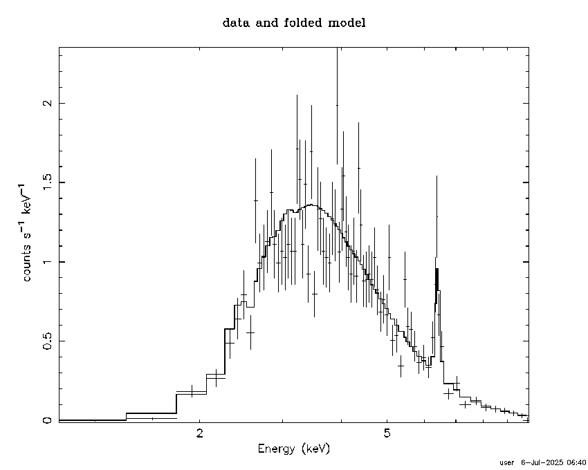

BXA/Xspec example scripts
==========================

This folder contains simple and complex examples
how BXA can be invoked for spectral analysis.

Please refer to https://johannesbuchner.github.io/BXA/
for full documentation, including how to install BXA.

Generate test data
-------------------

Generate test data with xspec using the commands in gen.xspec
This will produce a spectral file example-file.fak
representing a ATHENA observation of an absorbed AGN.

Expected output::

	$ < gen.xspec xspec

The spectrum looks something like this:

Simple analysis
-----------------

Have a look at the file example_simplest.py. It contains:

* Loading data
* setting up a model and its parameter ranges
* running a BXA fit with specified priors
* plotting the posterior predictions (convolved with the response)
* plotting the model (posterior predictions, not convolved)
* making a Q-Q plot

See https://johannesbuchner.github.io/BXA/ to understand the code.
See https://johannesbuchner.github.io/UltraNest/ to understand the output of the
fitting engine (for example, its `FAQ page <https://johannesbuchner.github.io/UltraNest/issues.html>`_).

Expected output::

	$ python3 example_simplest.py
	Default fit statistic is set to: C-Statistic
	   This will apply to all current and newly loaded spectra.

	1 spectrum  in use
	 
	Spectral Data File: example-file.fak  Spectrum 1
	Net count rate (cts/s) for Spectrum:1  4.224e+00 +/- 9.191e-02
	 Assigned to Data Group 1 and Plot Group 1
	  Noticed Channels:  1-4096
	  Telescope: ATHENA+ Instrument: WFI  Channel Type: PI
	  Exposure Time: 500 sec
	 Using fit statistic: cstat
	 Using Response (RMF) File            athenapp_ir_b4c_wfi_withfilter_fov40.0arcmin_avg.rsp for Source 1

	  4096 channels (1,4096) ignored in spectrum #     1

	   801 channels (11-811) noticed in spectrum #     1

	========================================================================
	Model powerlaw<1> Source No.: 1   Active/On
	Model Model Component  Parameter  Unit     Value
	 par  comp
	   1    1   powerlaw   PhoIndex            1.00000      +/-  0.0          
	   2    1   powerlaw   norm                1.00000      +/-  0.0          
	________________________________________________________________________

	Fit statistic  : C-Statistic              2.056191e+07     using 801 bins.

	Test statistic : Chi-Squared              4.197601e+11     using 801 bins.

	***Warning: Chi-square may not be valid due to bins with zero variance
				in spectrum number(s): 1 

	 Null hypothesis probability of 0.000000e+00 with 799 degrees of freedom
	 Current data and model not fit yet.

	Fit statistic  : C-Statistic              2.056191e+07     using 801 bins.

	Test statistic : Chi-Squared              4.197601e+11     using 801 bins.

	***Warning: Chi-square may not be valid due to bins with zero variance
				in spectrum number(s): 1 

	 Null hypothesis probability of 0.000000e+00 with 799 degrees of freedom
	 Current data and model not fit yet.

	Fit statistic  : C-Statistic              2.056191e+07     using 801 bins.

	Test statistic : Chi-Squared              4.197601e+11     using 801 bins.

	***Warning: Chi-square may not be valid due to bins with zero variance
				in spectrum number(s): 1 

	 Null hypothesis probability of 0.000000e+00 with 799 degrees of freedom
	 Current data and model not fit yet.
	  uniform prior for PhoIndex between 1.000000 and 3.000000 
	  jeffreys prior for norm between 1.000000e-10 and 1.000000e+01 
	   note: this parameter spans *many* dex. Double-check the limits are reasonable.
	running analysis ...
	[ultranest] Resuming from 7774 stored points

	Mono-modal Volume: ~exp(-4.24) * Expected Volume: exp(0.00) Quality: ok

	PhoIndex :      +1.0|*** ****************************** ****************************************************** **************|     +3.0
	log(norm):     -10.0|********************************************************************************************************|     +1.0

	Z=-1199206.7(0.00%) | Like=-1089578.51..-4277.72 [-1.045e+08..-4464] | it/evals=80/9998 eff=inf% N=400 

	Mono-modal Volume: ~exp(-4.24)   Expected Volume: exp(-0.23) Quality: correlation length: 3 (+)

	PhoIndex :      +1.0|********************************** ************* *******************************************************|     +3.0
	log(norm):     -10.0|************************************************************************************  -1.2              |     +1.0

	Z=-24616.1(0.00%) | Like=-24611.37..-4277.72 [-1.045e+08..-4464] | it/evals=160/9998 eff=inf% N=400 0 

	Mono-modal Volume: ~exp(-4.71) * Expected Volume: exp(-0.45) Quality: correlation length: 3 (+)

	PhoIndex :      +1.0|************************************************  ******************************************************|     +3.0
	log(norm):     -10.0|***********************************************************************  -2.6                           |     +1.0

	Z=-24587.0(0.00%) | Like=-24580.29..-4277.72 [-1.045e+08..-4464] | it/evals=240/9998 eff=inf% N=400 

	Mono-modal Volume: ~exp(-5.09) * Expected Volume: exp(-0.67) Quality: correlation length: 3 (+)

	PhoIndex :      +1.0|******************************************** ***  ********************************************** *******|     +3.0
	log(norm):     -10.0|       -8.6  **********************************************************  -2.6                           |     +1.0

	Z=-22026.7(0.00%) | Like=-22012.60..-4249.81 [-1.045e+08..-4464] | it/evals=320/9998 eff=inf% N=400 

	Mono-modal Volume: ~exp(-5.22) * Expected Volume: exp(-0.90) Quality: correlation length: 3 (+)

	PhoIndex :      +1.0|************************************************  ********************************************** *******|     +3.0
	log(norm):     -10.0|                  -7.4  * ********************************************  -2.7                            |     +1.0

	Z=-17640.5(0.00%) | Like=-17606.95..-4249.81 [-1.045e+08..-4464] | it/evals=440/9998 eff=inf% N=400 

	Mono-modal Volume: ~exp(-5.62) * Expected Volume: exp(-1.12) Quality: correlation length: 7 (-)

	PhoIndex :      +1.0|************* *********** *********************************************** ********************** *******|     +3.0
	log(norm):     -10.0|                       -6.9  ****************************************  -2.7                             |     +1.0

	Z=-14906.6(0.00%) | Like=-14871.21..-4107.51 [-1.045e+08..-4464] | it/evals=520/9998 eff=inf% N=400 

	Mono-modal Volume: ~exp(-5.62)   Expected Volume: exp(-1.35) Quality: correlation length: 7 (-)

	PhoIndex :      +1.0|************* ******************************** **************************  ***************** *** *******|     +3.0
	log(norm):     -10.0|                             -6.2  *********************************  -2.8                              |     +1.0

	Z=-12616.7(0.00%) | Like=-12563.04..-4107.51 [-1.045e+08..-4464] | it/evals=600/9998 eff=inf% N=400 

	Mono-modal Volume: ~exp(-5.62)   Expected Volume: exp(-1.57) Quality: correlation length: 138 (+)

	PhoIndex :      +1.0|************************************************************************* ****************** *** *******|     +3.0
	log(norm):     -10.0|                                 -5.8  *****************************  -2.9                              |     +1.0

	Z=-11330.7(0.00%) | Like=-11317.59..-4107.51 [-1.045e+08..-4464] | it/evals=680/9998 eff=inf% N=400 

	Mono-modal Volume: ~exp(-5.62)   Expected Volume: exp(-1.80) Quality: correlation length: 138 (+)

	PhoIndex :      +1.0|************************************************************************* ****** *********** *** **  ** |     +3.0
	log(norm):     -10.0|                                    -5.5  *************************  -3.0                               |     +1.0

	Z=-10142.8(0.00%) | Like=-10104.28..-4012.26 [-1.045e+08..-4464] | it/evals=800/9998 eff=inf% N=400 

	Mono-modal Volume: ~exp(-5.62)   Expected Volume: exp(-2.02) Quality: correlation length: 138 (+)

	PhoIndex :      +1.0|************************************************************************************ **  +2.7           |     +3.0
	log(norm):     -10.0|                                       -5.2  **********************  -3.0                               |     +1.0

	Z=-9350.6(0.00%) | Like=-9340.94..-3999.99 [-1.045e+08..-4464] | it/evals=880/9998 eff=inf% N=400 

	Mono-modal Volume: ~exp(-6.68) * Expected Volume: exp(-2.25) Quality: correlation length: 138 (+)

	PhoIndex :      +1.0|********************************************************** **************** **  +2.5                    |     +3.0
	log(norm):     -10.0|                                        -5.1  ********************  -3.0                                |     +1.0

	Z=-8487.4(0.00%) | Like=-8461.22..-3999.99 [-1.045e+08..-4464] | it/evals=960/9998 eff=inf% N=400 

	Mono-modal Volume: ~exp(-6.68)   Expected Volume: exp(-2.47) Quality: correlation length: 138 (+)

	PhoIndex :      +1.0|*********************************************************************  +2.3                             |     +3.0
	log(norm):     -10.0|                                         -5.0  *******************  -3.1                                |     +1.0

	Z=-7959.8(0.00%) | Like=-7951.14..-3999.99 [-1.045e+08..-4464] | it/evals=1040/9998 eff=inf% N=400 

	Mono-modal Volume: ~exp(-7.09) * Expected Volume: exp(-2.70) Quality: correlation length: 138 (+)

	PhoIndex :      +1.0|*************************************************************  +2.2                                     |     +3.0
	log(norm):     -10.0|                                          -4.8  ******************  -3.1                                |     +1.0

	Z=-7209.9(0.00%) | Like=-7199.17..-3999.99 [-1.045e+08..-4464] | it/evals=1160/9998 eff=inf% N=400 

	Mono-modal Volume: ~exp(-7.09)   Expected Volume: exp(-2.92) Quality: correlation length: 138 (+)

	PhoIndex :      +1.0|******************************************************  +2.0                                            |     +3.0
	log(norm):     -10.0|                                           -4.8  *****************  -3.1                                |     +1.0

	Z=-6843.0(0.00%) | Like=-6831.93..-3999.99 [-1.045e+08..-4464] | it/evals=1240/9998 eff=inf% N=400 

	Mono-modal Volume: ~exp(-7.21) * Expected Volume: exp(-3.15) Quality: correlation length: 138 (+)

	PhoIndex :      +1.0|***********************************************  +1.9                                                   |     +3.0
	log(norm):     -10.0|                                            -4.6  ***************  -3.2                                 |     +1.0

	Z=-6517.4(0.00%) | Like=-6505.49..-3999.99 [-1.045e+08..-4464] | it/evals=1320/9998 eff=inf% N=400 

	Mono-modal Volume: ~exp(-7.54) * Expected Volume: exp(-3.37) Quality: correlation length: 138 (+)

	PhoIndex :      +1.0|************************************** **  +1.8                                                         |     +3.0
	log(norm):     -10.0|                                             -4.5  **************  -3.2                                 |     +1.0

	Z=-6154.0(0.00%) | Like=-6136.17..-3999.99 [-1.045e+08..-4464] | it/evals=1400/9998 eff=inf% N=400 

	Mono-modal Volume: ~exp(-7.58) * Expected Volume: exp(-3.60) Quality: correlation length: 138 (+)

	PhoIndex :      +1.0|***********************************  +1.7                                                               |     +3.0
	log(norm):     -10.0|                                              -4.5  *************  -3.2                                 |     +1.0

	Z=-5713.5(0.00%) | Like=-5698.34..-3999.99 [-1.045e+08..-4464] | it/evals=1520/9998 eff=inf% N=400 

	Mono-modal Volume: ~exp(-7.92) * Expected Volume: exp(-3.82) Quality: correlation length: 138 (+)

	PhoIndex :      +1.0|******************************  +1.6                                                                    |     +3.0
	log(norm):     -10.0|                                               -4.4  ***********  -3.2                                  |     +1.0

	Z=-5453.8(0.00%) | Like=-5443.82..-3999.99 [-1.045e+08..-4464] | it/evals=1600/9998 eff=inf% N=400 

	Mono-modal Volume: ~exp(-8.29) * Expected Volume: exp(-4.05) Quality: correlation length: 138 (+)

	PhoIndex :      +1.0|***************************  +1.5                                                                       |     +3.0
	log(norm):     -10.0|                                               -4.3  ***********  -3.3                                  |     +1.0

	Z=-5295.9(0.00%) | Like=-5281.78..-3999.99 [-1.045e+08..-4464] | it/evals=1680/9998 eff=inf% N=400 

	Mono-modal Volume: ~exp(-8.58) * Expected Volume: exp(-4.27) Quality: correlation length: 138 (+)

	PhoIndex :      +1.0|***********************  +1.4                                                                           |     +3.0
	log(norm):     -10.0|                                                -4.2  **********  -3.3                                  |     +1.0

	Z=-5133.1(0.00%) | Like=-5122.61..-3999.99 [-1.045e+08..-4464] | it/evals=1760/9998 eff=inf% N=400 

	Mono-modal Volume: ~exp(-8.79) * Expected Volume: exp(-4.50) Quality: correlation length: 138 (+)

	PhoIndex :      +1.0|********************  +1.4                                                                              |     +3.0
	log(norm):     -10.0|                                                -4.2  *********  -3.3                                   |     +1.0

	Z=-4910.3(0.00%) | Like=-4894.69..-3999.99 [-1.045e+08..-4464] | it/evals=1880/9998 eff=inf% N=400 

	Mono-modal Volume: ~exp(-8.80) * Expected Volume: exp(-4.73) Quality: correlation length: 138 (+)

	PhoIndex :      +1.0|******************  +1.3                                                                                |     +3.0
	log(norm):     -10.0|                                                -4.2  *********  -3.4                                   |     +1.0

	Z=-4782.5(0.00%) | Like=-4771.37..-3982.36 [-1.045e+08..-4464] | it/evals=1960/9998 eff=inf% N=400 

	Mono-modal Volume: ~exp(-9.33) * Expected Volume: exp(-4.95) Quality: correlation length: 138 (+)

	PhoIndex :      +1.0|**************  +1.3                                                                                    |     +3.0
	log(norm):     -10.0|                                                 -4.1  ********  -3.4                                   |     +1.0

	Z=-4690.9(0.00%) | Like=-4678.74..-3982.36 [-1.045e+08..-4464] | it/evals=2040/9998 eff=inf% N=400 

	Mono-modal Volume: ~exp(-9.54) * Expected Volume: exp(-5.18) Quality: correlation length: 138 (+)

	PhoIndex :      +1.0|*************  +1.2                                                                                     |     +3.0
	log(norm):     -10.0|                                                 -4.1  ********  -3.4                                   |     +1.0

	Z=-4598.9(0.00%) | Like=-4587.54..-3982.36 [-1.045e+08..-4464] | it/evals=2120/9998 eff=inf% N=400 

	Mono-modal Volume: ~exp(-9.54)   Expected Volume: exp(-5.40) Quality: correlation length: 138 (+)

	PhoIndex :      +1.0|***********  +1.2                                                                                       |     +3.0
	log(norm):     -10.0|                                                  -4.0  *******  -3.4                                   |     +1.0

	Z=-4478.7(0.00%) | Like=-4467.91..-3982.36 [-1.045e+08..-4464] | it/evals=2240/9998 eff=inf% N=400 

	Mono-modal Volume: ~exp(-9.58) * Expected Volume: exp(-5.63) Quality: correlation length: 138 (+)

	PhoIndex :      +1.0|**********  +1.2                                                                                        |     +3.0
	log(norm):     -10.0|                                                  -4.0  *******  -3.4                                   |     +1.0

	Z=-4432.4(0.00%) | Like=-4421.72..-3982.36 [-4463.5054..-3989.7397] | it/evals=2320/9998 eff=inf% N=400 

	Mono-modal Volume: ~exp(-10.06) * Expected Volume: exp(-5.85) Quality: correlation length: 138 (+)

	PhoIndex :      +1.0|*********  +1.2                                                                                         |     +3.0
	log(norm):     -10.0|                                                  -4.0  ******  -3.5                                    |     +1.0

	Z=-4377.0(0.00%) | Like=-4364.58..-3982.36 [-4463.5054..-3989.7397] | it/evals=2400/9998 eff=inf% N=400 

	Mono-modal Volume: ~exp(-10.36) * Expected Volume: exp(-6.08) Quality: correlation length: 138 (+)

	PhoIndex :      +1.0|********  +1.1                                                                                          |     +3.0
	log(norm):     -10.0|                                                  -4.0  ******  -3.5                                    |     +1.0

	Z=-4331.8(0.00%) | Like=-4320.15..-3982.36 [-4463.5054..-3989.7397] | it/evals=2480/9998 eff=inf% N=400 

	Mono-modal Volume: ~exp(-10.82) * Expected Volume: exp(-6.30) Quality: correlation length: 138 (+)

	PhoIndex :      +1.0|*******  +1.1                                                                                           |     +3.0
	log(norm):     -10.0|                                                   -4.0  *****  -3.5                                    |     +1.0

	Z=-4264.1(0.00%) | Like=-4252.21..-3982.36 [-4463.5054..-3989.7397] | it/evals=2600/9998 eff=inf% N=400 

	Mono-modal Volume: ~exp(-10.88) * Expected Volume: exp(-6.53) Quality: correlation length: 138 (+)

	PhoIndex :      +1.0|******  +1.1                                                                                            |     +3.0
	log(norm):     -10.0|                                                   -3.9  *****  -3.5                                    |     +1.0

	Z=-4229.5(0.00%) | Like=-4216.96..-3982.36 [-4463.5054..-3989.7397] | it/evals=2680/9998 eff=inf% N=400 

	Mono-modal Volume: ~exp(-10.92) * Expected Volume: exp(-6.75) Quality: correlation length: 138 (+)

	PhoIndex :      +1.0|*****  +1.1                                                                                             |     +3.0
	log(norm):     -10.0|                                                   -3.9  *****  -3.5                                    |     +1.0

	Z=-4201.7(0.00%) | Like=-4190.06..-3982.36 [-4463.5054..-3989.7397] | it/evals=2760/9998 eff=inf% N=400 

	Mono-modal Volume: ~exp(-10.92)   Expected Volume: exp(-6.98) Quality: correlation length: 138 (+)

	PhoIndex :      +1.0|****  +1.1                                                                                              |     +3.0
	log(norm):     -10.0|                                                   -3.9  *****  -3.5                                    |     +1.0

	Z=-4177.4(0.00%) | Like=-4165.39..-3982.36 [-4463.5054..-3989.7397] | it/evals=2840/9998 eff=inf% N=400 

	Mono-modal Volume: ~exp(-11.42) * Expected Volume: exp(-7.20) Quality: correlation length: 138 (+)

	PhoIndex :      +1.0|****  +1.1                                                                                              |     +3.0
	log(norm):     -10.0|                                                   -3.9  *****  -3.5                                    |     +1.0

	Z=-4142.2(0.00%) | Like=-4130.12..-3982.36 [-4463.5054..-3989.7397] | it/evals=2960/9998 eff=inf% N=400 

	Mono-modal Volume: ~exp(-11.72) * Expected Volume: exp(-7.43) Quality: correlation length: 138 (+)

	PhoIndex :      +1.0|***  +1.1                                                                                               |     +3.0
	log(norm):     -10.0|                                                    -3.9  ***  -3.6                                     |     +1.0

	Z=-4125.2(0.00%) | Like=-4113.40..-3982.36 [-4463.5054..-3989.7397] | it/evals=3040/9998 eff=inf% N=400 

	Mono-modal Volume: ~exp(-11.72)   Expected Volume: exp(-7.65) Quality: correlation length: 138 (+)

	PhoIndex :     +1.00|***  +1.05                                                                                              |    +3.00
	log(norm):     -10.0|                                                    -3.9  ***  -3.6                                     |     +1.0

	Z=-4112.5(0.00%) | Like=-4100.48..-3982.36 [-4463.5054..-3989.7397] | it/evals=3120/9998 eff=inf% N=400 

	Mono-modal Volume: ~exp(-12.20) * Expected Volume: exp(-7.88) Quality: correlation length: 138 (+)

	PhoIndex :     +1.00|***  +1.04                                                                                              |    +3.00
	log(norm):     -10.0|                                                    -3.8  ***  -3.6                                     |     +1.0

	Z=-4097.9(0.00%) | Like=-4085.71..-3982.36 [-4463.5054..-3989.7397] | it/evals=3200/9998 eff=inf% N=400 

	Mono-modal Volume: ~exp(-12.47) * Expected Volume: exp(-8.10) Quality: correlation length: 138 (+)

	PhoIndex :     +1.00|**  +1.04                                                                                               |    +3.00
	log(norm):     -10.0|                                                    -3.8  ***  -3.6                                     |     +1.0

	Z=-4081.3(0.00%) | Like=-4068.97..-3982.36 [-4463.5054..-3989.7397] | it/evals=3320/9998 eff=inf% N=400 

	Mono-modal Volume: ~exp(-12.74) * Expected Volume: exp(-8.33) Quality: correlation length: 138 (+)

	PhoIndex :     +1.00|**  +1.03                                                                                               |    +3.00
	log(norm):     -10.0|                                                    -3.8  ***  -3.6                                     |     +1.0

	Z=-4071.5(0.00%) | Like=-4059.19..-3982.36 [-4463.5054..-3989.7397] | it/evals=3400/9998 eff=inf% N=400 

	Mono-modal Volume: ~exp(-12.74)   Expected Volume: exp(-8.55) Quality: correlation length: 138 (+)

	PhoIndex :     +1.00|**  +1.03                                                                                               |    +3.00
	log(norm):     -10.0|                                                    -3.8  ***  -3.6                                     |     +1.0

	Z=-4062.5(0.00%) | Like=-4049.76..-3982.36 [-4463.5054..-3989.7397] | it/evals=3480/9998 eff=inf% N=400 

	Mono-modal Volume: ~exp(-12.97) * Expected Volume: exp(-8.78) Quality: correlation length: 138 (+)

	PhoIndex :     +1.00|**  +1.03                                                                                               |    +3.00
	log(norm):     -10.0|                                                    -3.8  ***  -3.6                                     |     +1.0

	Z=-4054.7(0.00%) | Like=-4041.98..-3982.36 [-4463.5054..-3989.7397] | it/evals=3560/9998 eff=inf% N=400 

	Mono-modal Volume: ~exp(-13.07) * Expected Volume: exp(-9.00) Quality: correlation length: 138 (+)

	PhoIndex :     +1.00|**  +1.02                                                                                               |    +3.00
	log(norm):     -10.0|                                                    -3.8  ***  -3.6                                     |     +1.0

	Z=-4043.3(0.00%) | Like=-4030.59..-3982.36 [-4463.5054..-3989.7397] | it/evals=3680/9998 eff=inf% N=400 

	Mono-modal Volume: ~exp(-13.62) * Expected Volume: exp(-9.23) Quality: correlation length: 138 (+)

	PhoIndex :     +1.00|*  +1.02                                                                                                |    +3.00
	log(norm):     -10.0|                                                    -3.8  ***  -3.6                                     |     +1.0

	Z=-4037.6(0.00%) | Like=-4024.95..-3982.36 [-4463.5054..-3989.7397] | it/evals=3760/9998 eff=inf% N=400 

	Mono-modal Volume: ~exp(-13.62)   Expected Volume: exp(-9.45) Quality: correlation length: 138 (+)

	PhoIndex :     +1.00|*  +1.02                                                                                                |    +3.00
	log(norm):     -10.0|                                                    -3.8  ***  -3.6                                     |     +1.0

	Z=-4032.7(0.00%) | Like=-4019.72..-3982.36 [-4463.5054..-3989.7397] | it/evals=3840/9998 eff=inf% N=400 

	Mono-modal Volume: ~exp(-13.63) * Expected Volume: exp(-9.68) Quality: correlation length: 138 (+)

	PhoIndex :     +1.00|*  +1.01                                                                                                |    +3.00
	log(norm):     -10.0|                                                    -3.8  ***  -3.6                                     |     +1.0

	Z=-4028.1(0.00%) | Like=-4015.04..-3982.36 [-4463.5054..-3989.7397] | it/evals=3920/9998 eff=inf% N=400 

	Mono-modal Volume: ~exp(-13.63)   Expected Volume: exp(-9.90) Quality: correlation length: 138 (+)

	PhoIndex :     +1.00|*  +1.01                                                                                                |    +3.00
	log(norm):     -10.0|                                                    -3.8  ***  -3.6                                     |     +1.0

	Z=-4022.3(0.00%) | Like=-4009.63..-3982.36 [-4463.5054..-3989.7397] | it/evals=4040/9998 eff=inf% N=400 

	Mono-modal Volume: ~exp(-13.67) * Expected Volume: exp(-10.13) Quality: correlation length: 138 (+)

	PhoIndex :     +1.00|*  +1.01                                                                                                |    +3.00
	log(norm):     -10.0|                                                    -3.8  ***  -3.6                                     |     +1.0

	Z=-4019.7(0.00%) | Like=-4006.75..-3982.05 [-4463.5054..-3989.7397] | it/evals=4120/9998 eff=inf% N=400 

	Mono-modal Volume: ~exp(-14.60) * Expected Volume: exp(-10.35) Quality: correlation length: 138 (+)

	PhoIndex :    +1.000|*  +1.009                                                                                               |   +3.000
	log(norm):     -10.0|                                                    -3.8  ***  -3.6                                     |     +1.0

	Z=-4016.5(0.00%) | Like=-4003.14..-3982.05 [-4463.5054..-3989.7397] | it/evals=4200/9998 eff=inf% N=400 

	Mono-modal Volume: ~exp(-14.60)   Expected Volume: exp(-10.58) Quality: correlation length: 138 (+)

	PhoIndex :    +0.000|                          +1.000  *  +1.008                                                             |   +3.000
	log(norm):     -10.0|                                                    -3.8  ***  -3.6                                     |     +1.0

	Z=-4013.9(0.00%) | Like=-4000.81..-3982.05 [-4463.5054..-3989.7397] | it/evals=4280/9998 eff=inf% N=400 

	Mono-modal Volume: ~exp(-14.90) * Expected Volume: exp(-10.80) Quality: correlation length: 138 (+)

	PhoIndex :    +0.000|                          +1.000  *  +1.007                                                             |   +3.000
	log(norm):     -10.0|                                                     -3.8  **  -3.7                                     |     +1.0

	Z=-4010.9(0.00%) | Like=-3997.63..-3982.05 [-4463.5054..-3989.7397] | it/evals=4400/9998 eff=inf% N=400 

	Mono-modal Volume: ~exp(-14.90)   Expected Volume: exp(-11.02) Quality: correlation length: 138 (+)

	PhoIndex :    +0.000|                          +1.000  *  +1.006                                                             |   +3.000
	log(norm):     -10.0|                                                     -3.8  *  -3.7                                      |     +1.0

	Z=-4009.0(0.00%) | Like=-3995.58..-3982.00 [-4463.5054..-3989.7397] | it/evals=4480/9998 eff=inf% N=400 

	Mono-modal Volume: ~exp(-14.98) * Expected Volume: exp(-11.25) Quality: correlation length: 138 (+)

	PhoIndex :    +0.000|                          +1.000  *  +1.005                                                             |   +3.000
	log(norm):     -10.0|                                                     -3.8  *  -3.7                                      |     +1.0

	Z=-4007.3(0.00%) | Like=-3993.83..-3982.00 [-4463.5054..-3989.7397] | it/evals=4560/9998 eff=inf% N=400 

	Mono-modal Volume: ~exp(-15.52) * Expected Volume: exp(-11.47) Quality: ok

	PhoIndex :    +0.000|                          +1.000  *  +1.005                                                             |   +3.000
	log(norm):    -10.00|                                                    -3.75  *  -3.66                                     |    +1.00

	Z=-4005.9(0.01%) | Like=-3992.38..-3982.00 [-4463.5054..-3989.7397] | it/evals=4640/9998 eff=inf% N=400 

	Mono-modal Volume: ~exp(-15.64) * Expected Volume: exp(-11.70) Quality: ok

	PhoIndex :    +0.000|                          +1.000  *  +1.004                                                             |   +3.000
	log(norm):    -10.00|                                                    -3.75  *  -3.66                                     |    +1.00

	Z=-4004.1(0.05%) | Like=-3990.42..-3982.00 [-4463.5054..-3989.7397] | it/evals=4760/9998 eff=inf% N=400 

	Mono-modal Volume: ~exp(-15.87) * Expected Volume: exp(-11.92) Quality: ok

	PhoIndex :    +1.000|*  +1.003                                                                                               |   +3.000
	log(norm):    -10.00|                                                    -3.74  *  -3.67                                     |    +1.00

	Z=-4003.0(0.15%) | Like=-3989.36..-3982.00 [-3989.7372..-3985.9702] | it/evals=4840/9998 eff=inf% N=400 

	Mono-modal Volume: ~exp(-15.98) * Expected Volume: exp(-12.15) Quality: ok

	PhoIndex :    +1.000|*  +1.003                                                                                               |   +3.000
	log(norm):    -10.00|                                                    -3.74  *  -3.67                                     |    +1.00

	Z=-4002.1(0.36%) | Like=-3988.45..-3981.72 [-3989.7372..-3985.9702] | it/evals=4920/9998 eff=inf% N=400 

	Mono-modal Volume: ~exp(-15.98)   Expected Volume: exp(-12.37) Quality: ok

	PhoIndex :    +1.000|*  +1.003                                                                                               |   +3.000
	log(norm):    -10.00|                                                    -3.74  *  -3.67                                     |    +1.00

	Z=-4001.4(0.77%) | Like=-3987.64..-3981.72 [-3989.7372..-3985.9702] | it/evals=5000/9998 eff=inf% N=400 

	Mono-modal Volume: ~exp(-15.98)   Expected Volume: exp(-12.60) Quality: ok

	PhoIndex :    +1.000|*  +1.002                                                                                               |   +3.000
	log(norm):    -10.00|                                                    -3.74  *  -3.67                                     |    +1.00

	Z=-4000.4(2.08%) | Like=-3986.43..-3981.72 [-3989.7372..-3985.9702] | it/evals=5120/9998 eff=inf% N=400 

	Mono-modal Volume: ~exp(-16.80) * Expected Volume: exp(-12.82) Quality: ok

	PhoIndex :    +1.000|*  +1.002                                                                                               |   +3.000
	log(norm):    -10.00|                                                    -3.73  *  -3.68                                     |    +1.00

	Z=-3999.8(3.77%) | Like=-3985.82..-3981.72 [-3985.9603..-3984.9917] | it/evals=5200/9998 eff=inf% N=400 

	Mono-modal Volume: ~exp(-17.13) * Expected Volume: exp(-13.05) Quality: ok

	PhoIndex :    +0.000|                          +1.000  *  +1.002                                                             |   +3.000
	log(norm):    -10.00|                                                    -3.73  *  -3.68                                     |    +1.00

	Z=-3999.3(6.15%) | Like=-3985.22..-3981.72 [-3985.9603..-3984.9917] | it/evals=5280/9998 eff=inf% N=400 

	Mono-modal Volume: ~exp(-17.48) * Expected Volume: exp(-13.27) Quality: ok

	PhoIndex :    +0.000|                          +1.000  *  +1.001                                                             |   +3.000
	log(norm):    -10.00|                                                    -3.73  *  -3.68                                     |    +1.00

	Z=-3998.9(9.69%) | Like=-3984.76..-3981.72 [-3984.9915..-3984.7164] | it/evals=5360/9998 eff=inf% N=400 

	Mono-modal Volume: ~exp(-17.48)   Expected Volume: exp(-13.50) Quality: ok

	PhoIndex :    +0.000|                          +1.000  *  +1.001                                                             |   +3.000
	log(norm):    -10.00|                                                    -3.73  *  -3.68                                     |    +1.00

	Z=-3998.3(15.99%) | Like=-3984.18..-3981.72 [-3984.1771..-3984.1735]*| it/evals=5480/9998 eff=inf% N=400 

	Mono-modal Volume: ~exp(-17.96) * Expected Volume: exp(-13.72) Quality: ok

	PhoIndex :   +0.0000|                         +1.0000  *  +1.0009                                                            |  +3.0000
	log(norm):    -10.00|                                                    -3.72  *  -3.68                                     |    +1.00

	Z=-3998.0(21.62%) | Like=-3983.83..-3981.72 [-3983.8254..-3983.8241]*| it/evals=5560/9998 eff=inf% N=400 

	Mono-modal Volume: ~exp(-18.00) * Expected Volume: exp(-13.95) Quality: ok

	PhoIndex :   +0.0000|                         +1.0000  *  +1.0008                                                            |  +3.0000
	log(norm):    -10.00|                                                    -3.72  *  -3.69                                     |    +1.00

	Z=-3997.8(27.36%) | Like=-3983.57..-3981.72 [-3983.5739..-3983.5731]*| it/evals=5640/9998 eff=inf% N=400 

	Mono-modal Volume: ~exp(-18.00)   Expected Volume: exp(-14.17) Quality: ok

	PhoIndex :   +0.0000|                         +1.0000  *  +1.0007                                                            |  +3.0000
	log(norm):    -10.00|                                                    -3.72  *  -3.69                                     |    +1.00

	Z=-3997.6(33.46%) | Like=-3983.34..-3981.72 [-3983.3412..-3983.3404]*| it/evals=5720/9998 eff=inf% N=400 

	Mono-modal Volume: ~exp(-18.30) * Expected Volume: exp(-14.40) Quality: ok

	PhoIndex :   +0.0000|                         +1.0000  *  +1.0006                                                            |  +3.0000
	log(norm):    -10.00|                                                    -3.72  *  -3.69                                     |    +1.00

	Z=-3997.3(43.09%) | Like=-3983.05..-3981.72 [-3983.0510..-3983.0499]*| it/evals=5840/9998 eff=inf% N=400 

	Mono-modal Volume: ~exp(-18.60) * Expected Volume: exp(-14.62) Quality: ok

	PhoIndex :   +0.0000|                         +1.0000  *  +1.0005                                                            |  +3.0000
	log(norm):    -10.00|                                                    -3.72  *  -3.69                                     |    +1.00

	Z=-3997.2(49.39%) | Like=-3982.88..-3981.72 [-3982.8831..-3982.8826]*| it/evals=5920/9998 eff=inf% N=400 

	Mono-modal Volume: ~exp(-18.60)   Expected Volume: exp(-14.85) Quality: ok

	PhoIndex :   +0.0000|                         +1.0000  *  +1.0004                                                            |  +3.0000
	log(norm):    -10.00|                                                    -3.72  *  -3.69                                     |    +1.00

	Z=-3997.1(55.26%) | Like=-3982.73..-3981.72 [-3982.7344..-3982.7238]*| it/evals=6000/9998 eff=inf% N=400 

	Mono-modal Volume: ~exp(-19.34) * Expected Volume: exp(-15.07) Quality: ok

	PhoIndex :   +0.0000|                         +1.0000  *  +1.0004                                                            |  +3.0000
	log(norm):    -10.00|                                                    -3.72  *  -3.69                                     |    +1.00

	Z=-3997.0(60.47%) | Like=-3982.61..-3981.72 [-3982.6099..-3982.6089]*| it/evals=6080/9998 eff=inf% N=400 

	Mono-modal Volume: ~exp(-19.41) * Expected Volume: exp(-15.30) Quality: ok

	PhoIndex :   +0.0000|                         +1.0000  *  +1.0003                                                            |  +3.0000
	log(norm):    -10.00|                                                    -3.72  *  -3.69                                     |    +1.00

	Z=-3996.9(67.93%) | Like=-3982.43..-3981.71 [-3982.4345..-3982.4335]*| it/evals=6200/9998 eff=inf% N=400 

	Mono-modal Volume: ~exp(-19.41)   Expected Volume: exp(-15.52) Quality: ok

	PhoIndex :   +0.0000|                         +1.0000  *  +1.0003                                                            |  +3.0000
	log(norm):    -10.00|                                                    -3.72  *  -3.69                                     |    +1.00

	Z=-3996.8(72.46%) | Like=-3982.35..-3981.71 [-3982.3491..-3982.3480]*| it/evals=6280/9998 eff=inf% N=400 

	Mono-modal Volume: ~exp(-19.41)   Expected Volume: exp(-15.75) Quality: ok

	PhoIndex :   +0.0000|                         +1.0000  *  +1.0002                                                            |  +3.0000
	log(norm):    -10.00|                                                    -3.71  *  -3.69                                     |    +1.00

	Z=-3996.8(76.31%) | Like=-3982.26..-3981.71 [-3982.2620..-3982.2615]*| it/evals=6360/9998 eff=inf% N=400 

	Mono-modal Volume: ~exp(-20.34) * Expected Volume: exp(-15.97) Quality: ok

	PhoIndex :   +0.0000|                         +1.0000  *  +1.0002                                                            |  +3.0000
	log(norm):    -10.00|                                                    -3.71  *  -3.70                                     |    +1.00

	Z=-3996.7(79.83%) | Like=-3982.19..-3981.71 [-3982.1899..-3982.1896]*| it/evals=6440/9998 eff=inf% N=400 

	Mono-modal Volume: ~exp(-20.34)   Expected Volume: exp(-16.20) Quality: ok

	PhoIndex :   +0.0000|                         +1.0000  *  +1.0002                                                            |  +3.0000
	log(norm):    -10.00|                                                    -3.71  *  -3.70                                     |    +1.00

	Z=-3996.7(84.18%) | Like=-3982.10..-3981.71 [-3982.0967..-3982.0964]*| it/evals=6560/9998 eff=inf% N=400 

	Mono-modal Volume: ~exp(-20.85) * Expected Volume: exp(-16.42) Quality: correlation length: 1913 (+)

	PhoIndex :   +0.0000|                         +1.0000  *  +1.0002                                                            |  +3.0000
	log(norm):    -10.00|                                                    -3.71  *  -3.70                                     |    +1.00

	Z=-3996.6(86.72%) | Like=-3982.05..-3981.71 [-3982.0485..-3982.0484]*| it/evals=6640/9998 eff=inf% N=400 

	Mono-modal Volume: ~exp(-20.85)   Expected Volume: exp(-16.65) Quality: correlation length: 1913 (+)

	PhoIndex :   +0.0000|                         +1.0000  *  +1.0001                                                            |  +3.0000
	log(norm):    -10.00|                                                    -3.71  *  -3.70                                     |    +1.00

	Z=-3996.6(88.86%) | Like=-3982.01..-3981.71 [-3982.0075..-3982.0073]*| it/evals=6720/9998 eff=inf% N=400 

	Mono-modal Volume: ~exp(-20.98) * Expected Volume: exp(-16.87) Quality: correlation length: 1913 (+)

	PhoIndex :   +0.0000|                         +1.0000  *  +1.0001                                                            |  +3.0000
	log(norm):    -10.00|                                                    -3.71  *  -3.70                                     |    +1.00

	Z=-3996.6(90.64%) | Like=-3981.97..-3981.71 [-3981.9691..-3981.9688]*| it/evals=6800/9998 eff=inf% N=400 

	Mono-modal Volume: ~exp(-21.09) * Expected Volume: exp(-17.10) Quality: correlation length: 1913 (+)

	PhoIndex :  +0.00000|                        +1.00000  *  +1.00010                                                           | +3.00000
	log(norm):    -10.00|                                                    -3.71  *  -3.70                                     |    +1.00

	Z=-3996.6(92.87%) | Like=-3981.92..-3981.71 [-3981.9174..-3981.9172]*| it/evals=6920/9998 eff=inf% N=400 

	Mono-modal Volume: ~exp(-21.35) * Expected Volume: exp(-17.32) Quality: correlation length: 1913 (+)

	PhoIndex :  +0.00000|                        +1.00000  *  +1.00008                                                           | +3.00000
	log(norm):    -10.00|                                                    -3.71  *  -3.70                                     |    +1.00

	Z=-3996.5(94.07%) | Like=-3981.89..-3981.70 [-3981.8892..-3981.8890]*| it/evals=7000/9998 eff=inf% N=400 

	Mono-modal Volume: ~exp(-21.35)   Expected Volume: exp(-17.55) Quality: correlation length: 1913 (+)

	PhoIndex :  +0.00000|                        +1.00000  *  +1.00007                                                           | +3.00000
	log(norm):    -10.00|                                                    -3.71  *  -3.70                                     |    +1.00

	Z=-3996.5(95.08%) | Like=-3981.86..-3981.70 [-3981.8634..-3981.8630]*| it/evals=7080/9998 eff=inf% N=400 

	Mono-modal Volume: ~exp(-22.00) * Expected Volume: exp(-17.77) Quality: correlation length: 1913 (+)

	PhoIndex :  +0.00000|                        +1.00000  *  +1.00006                                                           | +3.00000
	log(norm):    -10.00|                                                    -3.71  *  -3.70                                     |    +1.00

	Z=-3996.5(95.92%) | Like=-3981.84..-3981.70 [-3981.8409..-3981.8407]*| it/evals=7160/9998 eff=inf% N=400 

	Mono-modal Volume: ~exp(-22.05) * Expected Volume: exp(-18.00) Quality: correlation length: 1913 (+)

	PhoIndex :  +0.00000|                        +1.00000  *  +1.00005                                                           | +3.00000
	log(norm):   -10.000|                                                   -3.709  *  -3.699                                    |   +1.000

	Z=-3996.5(96.93%) | Like=-3981.81..-3981.70 [-3981.8147..-3981.8146]*| it/evals=7280/9998 eff=inf% N=400 

	Mono-modal Volume: ~exp(-22.35) * Expected Volume: exp(-18.23) Quality: correlation length: 1913 (+)

	PhoIndex :  +0.00000|                        +1.00000  *  +1.00004                                                           | +3.00000
	log(norm):   -10.000|                                                   -3.709  *  -3.700                                    |   +1.000

	[ultranest] Explored until L=-4e+03  981.70 [-3981.7988..-3981.7987]*| it/evals=7360/9998 eff=inf% N=400 
	[ultranest] Likelihood function evaluations: 9998
	[ultranest] Writing samples and results to disk ...
	[ultranest] Writing samples and results to disk ... done
	[ultranest]   logZ = -3996 +- 0.1528
	[ultranest] Posterior uncertainty strategy is satisfied (KL: 0.46+-0.08 nat, need <0.50 nat)
	[ultranest] Evidency uncertainty strategy is satisfied (dlogz=0.39, need <0.5)
	[ultranest]   logZ error budget: single: 0.18 bs:0.15 tail:0.02 total:0.15 required:<0.50
	[ultranest] done iterating.

	logZ = -3996.484 +- 0.389
	  single instance: logZ = -3996.484 +- 0.183
	  bootstrapped   : logZ = -3996.490 +- 0.389
	  tail           : logZ = +- 0.024
	insert order U test : converged: False correlation: 3.0 iterations

		PhoIndex            1.00038 +- 0.00038
		log(norm)           -3.7043 +- 0.0094
	running analysis ... done!
	creating plot of posterior predictions against data ...
	100%|████████████████████████████████████████████████████████████████████████████████████████████████| 100/100 [00:00<00:00, 107.90it/s]
	binning for plot...
	100%|█████████████████████████████████████████████████████████████████████████████████████████████████| 100/100 [00:01<00:00, 85.53it/s]
	saving plot...
	creating plot of posterior predictions ...
	100%|████████████████████████████████████████████████████████████████████████████████████████████████| 100/100 [00:00<00:00, 117.24it/s]
	saving plot...
	creating quantile-quantile plot ...
	saving plot...

Output files::

	$ find simplest/
	simplest/
	simplest/debug.log
	simplest/convolved_posterior.pdf
	simplest/chain.fits
	simplest/plots
	simplest/plots/corner.pdf
	simplest/plots/trace.pdf
	simplest/plots/run.pdf
	simplest/unconvolved_posterior.pdf
	simplest/info
	simplest/info/post_summary.csv
	simplest/info/results.json
	simplest/qq_model_deviations.pdf
	simplest/results
	simplest/results/points.hdf5
	simplest/extra
	simplest/chains
	simplest/chains/run.txt
	simplest/chains/weighted_post_untransformed.txt
	simplest/chains/equal_weighted_post.txt
	simplest/chains/weighted_post.txt

"simplest/" is the `outputfiles_basename` defined in the script.

The most important files are:

* unconvolved_posterior.pdf : 

	.. image:: reference-output/unconvolved_posterior.png
	
	The model itself is a powerlaw, and the uncertainties are too narrow to see.

	For further explanation of this plot, see https://johannesbuchner.github.io/BXA/xspec-analysis.html

* convolved_posterior.pdf : 

	.. image:: reference-output/convolved_posterior.png
	
	The model and the data convolved through the response. 
	Red means the data are poorly fitted by this model.
	The model is clearly off -- For example, the lower energy X-rays are overpredicted.

	For further explanation of this plot, see https://johannesbuchner.github.io/BXA/xspec-analysis.html

* plots/corner.pdf:

	.. image:: reference-output/corner.png
	
	Plot of the parameter constraints and uncertainties and their correlations.
	The photon index parameter is hitting the edge of the parameter space,
	and its uncertainties are tiny. Another hint of a poor model.

	For further explanation of this plot, see https://johannesbuchner.github.io/BXA/xspec-analysis.html

* qq_model_deviations.pdf : 
	
	.. image:: reference-output/qq_model_deviations.png
	
	`Q-Q plot <https://en.wikipedia.org/wiki/Q%E2%80%93Q_plot>`_:
	The red curve is far from the 1:1 line. That it is on the bottom right
	indicates the model produces many more counts than the data.
	The tickmarks indicate that the problem is accumulating below 2keV.

	For further explanation of this plot, see https://johannesbuchner.github.io/BXA/xspec-analysis.html

* info/results.json: summary of all parameters, their uncertainties and estimated lnZ
* info/post_summary.csv: summary of all parameters and their uncertainties as CSV
* chains/equal_weighted_post.txt: contains posterior samples: each row is a model parameter vector. You can iterate through these, set up the model in pyxspec, and then do something with it (compute fluxes and luminosities, for example).

Other examples
---------------

* example_advanced_priors.py shows a absorbed powerlaw fit, which is better. It 
  also demonstrates how to specify custom prior functions.

  Run with::
	
	$ python3 example_advanced_priors.py example-file.fak absorbed/
	
  Here the spectral file and output folder are command line arguments,
  which is convenient for analysing many sources.

* example_custom_run.py finally adds a emission line. Run with::

	$ python3 example_custom_run.py example-file.fak line/

Compare the models with::

	$ python3 model_compare.py absorbed simplest line

	Model comparison
	****************

	model simplest  : log10(Z) = -1519.1  XXX ruled out
	model absorbed  : log10(Z) =    -5.6  XXX ruled out
	model line      : log10(Z) =     0.0    <-- GOOD

	The last, most likely model was used as normalization.
	Uniform model priors are assumed, with a cut of log10(30) to rule out models.

Beware of the caveats of these log10(Z) differences (log-Bayes factors),
and derive thresholds with simulated data. 

For the full documentation, see https://johannesbuchner.github.io/BXA/xspec-analysis.html

Please explore this folder for other demo scripts.
